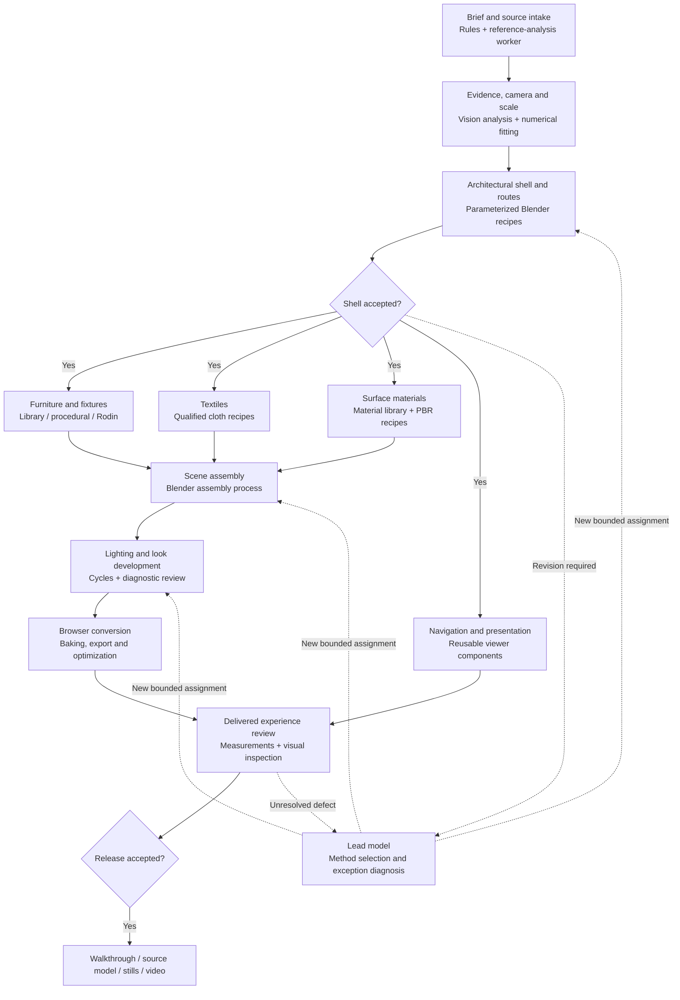

# 3D property factory: specialized workers, inspectable workflows and measured model selection

## 1. Operating principles and production workflow

Build a repeatable production system in which **every task has an explicit assignment, every result has acceptance evidence, and every worker can be replaced independently**.

A property brief starts a predefined workflow. The lead model selects approved methods, supplies project parameters and handles exceptions. It does not invent the entire production process afresh for each property.

Preserve the agreed initial scope: existing photographs and plans, convincing approximation without contradicting known property features, premium desktop browser walkthroughs, lighter mobile delivery, and reusable source scenes for stills and video. Qualify one connected room suite before expanding. The target of 5–10 properties per month remains a throughput hypothesis.

The diagram below is the overview; each production node will expand into its smaller assignments in the dashboard.

The furniture, textile, material and viewer branches can progress concurrently once their required inputs are accepted. Assembly waits for the asset versions it consumes; release waits for all required checks.

Dependencies belong to **tasks and artifacts**, rather than individual agent sessions. A worker can finish Property A’s task and take Property B’s next eligible task while A waits elsewhere.

Use two levels of orchestration:

- **Software controller:** dependencies, dispatch, budgets, resource reservations, retries and recorded state.
- **Lead model:** professional judgment, unusual method selection, difficult diagnosis and proposed workflow improvements.

Start with direct tool and agent adapters. Keep Orca as an optional agent-management adapter, subject to its own qualification. The factory records remain authoritative regardless of which application launches an agent.

## 2. Versioned assignments and professional skills

Define four separate objects:

| Object | Purpose |
|---|---|
| **Task definition** | Reusable specification of the work and its acceptance criteria |
| **Work order** | That task instantiated for a particular property and input versions |
| **Attempt** | One execution using a recorded worker configuration |
| **Result** | Produced artifacts, checks, costs, uncertainties and acceptance decision |

Each task definition must contain:

- Objective and explicit boundaries.
- Required inputs and prerequisite approvals.
- Output artifacts and permitted modifications.
- Professional skill, references and executable recipe.
- Prompt template, or command and parameters for non-LLM workers.
- Measurable requirements and visual acceptance criteria.
- Allowed tools, resource requirements and execution limits.
- Failure diagnosis, retry limit and escalation conditions.
- Upstream dependencies and downstream consumers.

For an LLM attempt, retain the template **and the exact populated assignment**, input references, supplied skills and tool configuration. Record application-added instructions where observable; identify unavailable context rather than claiming a complete capture.

For deterministic workers, the equivalent record is the executable version, command, parameters and inputs. Do not introduce an LLM merely to give every node a prompt.

For example, a furniture-conditioning assignment would specify:

> Normalize this approved chair asset to the supplied dimensions and coordinate system. Preserve its silhouette and material assignments. Modify only the designated asset output. Produce the conditioned model, dimensional report and six inspection views. Flag missing geometry or ambiguous proportions; do not invent a replacement design.

Its numerical checks and visual requirements are defined before execution. A successful script exit alone cannot accept the chair.

**Professional knowledge becomes a versioned production dependency.** Prioritize reference analysis, camera/scale fitting, architectural construction, asset conditioning, cloth, UVs, materials, lighting and realtime conversion. Each skill contains decision procedures, executable components, accepted/rejected examples and known limitations.

A proposed improvement creates a new version. Existing builds retain their original versions, allowing us to distinguish a model improvement from a prompt, recipe or tool change.

Split tasks where there is a meaningful reusable result or independent acceptance decision. Keep tightly coupled operations together when splitting them would create excessive handoffs—for example, a bounded camera-and-geometry fitting loop.

## 3. Local, read-only dashboard

Build a browser dashboard running on your Mac. **Operational instructions remain in Codex**, as you selected. The dashboard displays actual controller records rather than relying on agents to write periodic status summaries.

The documented workflow and the displayed diagram come from the same task definitions. This prevents the plan from drifting away from execution.

| View | What you can inspect |
|---|---|
| **Factory overview** | Properties, accepted milestones, current blockers, queues, spending and last update |
| **Workflow explorer** | Expandable stages and tasks, dependency paths, current versus planned execution |
| **Worker timeline** | Assigned work, execution periods, provider waits, resource waits and actual parallel activity |
| **Artifact library** | Models, renders, textures, scripts, provenance, versions and acceptance evidence |
| **Evaluation lab** | Model comparisons, effort settings, quality results, costs and promotion decisions |

Clicking a task opens an inspector containing:

- Its objective, requirements and success criteria.
- The exact assignment and skill versions.
- Requested model, reported model where available, effort and execution environment.
- Input artifacts and the tasks that produced them.
- Downstream work waiting for its result.
- Attempts, commands, tool activity and concise decision summaries.
- Output previews, inspection evidence and unresolved defects.
- Why it is waiting, blocked, rejected or accepted.

Show these states distinctly: **waiting for dependencies, ready, executing, waiting for provider/resource, awaiting review, accepted, needs revision, failed, cancelled and superseded**.

Display synchronization explicitly: “waiting for approved shell,” “waiting for GPU,” and “waiting for Rodin” are different conditions. Avoid treating all three as “blocked.”

Implementation defaults:

- Python controller, SQLite production ledger and filesystem artifact storage.
- Local web interface with a graph view; refresh from the ledger every five seconds.
- Versioned task/skill definitions in Git; large artifacts referenced by checksums.
- Append-only execution events supporting reconstruction after restart.
- Visible timestamps and stale-status indicators. Loss of a heartbeat means execution is unconfirmed, not automatically failed.
- Read-only dashboard endpoints for workflows, runs, attempts, artifacts and evaluations.

One worker owns a mutable artifact at a time. Publish accepted versions immutably; corrections create new versions and invalidate affected downstream work.

Initially allow two active properties, one heavy GPU operation and one desktop-control session. Other concurrency must respect measured machine capacity. Closing the dashboard must not stop production.

## 4. Model and effort evaluation without duplicating every project

**Yes: use controlled comparisons on selected tasks, not permanent A/B duplication of whole properties.**

The new releases are verified: GPT-6 Sol and Claude Opus 5.5 were released on September 22, 2026. Sol targets coding and agentic workflows; Opus 5.5 targets long-running agentic coding and knowledge work. They enter the candidate registry rather than immediately replacing existing workers. [OpenAI release notes](https://learn.chatgpt.com/docs/changelog), [Anthropic model documentation](https://platform.claude.com/docs/en/models/opus-5-5/overview).

Evaluate a complete configuration:

**model + effort + prompt + skill + tools + execution limits**

Effort names are not equivalent amounts of computation across models. Anthropic explicitly recommends a fresh effort sweep for Opus 5.5, whose default is medium. [Effort documentation](https://platform.claude.com/docs/en/build-with-claude/effort).

Use this qualification sequence:

| Stage | Procedure | Decision |
|---|---|---|
| **Evidence screening** | Review model cards, relevant evaluations, modalities, availability and migration requirements | Is this a credible candidate for this specific role? |
| **Compatibility checks** | Verify required tools, outputs, files, interruption handling and usage reporting | Can it operate our worker interface? |
| **Small comparison** | Run the incumbent and at most two challengers on three frozen representative cases | Eliminate clear failures cheaply |
| **Focused evaluation** | Compare finalists on six development cases; test a second effort setting only where useful | Select a candidate configuration |
| **Held-out evaluation** | Evaluate on six previously unused cases, including difficult cases and another property | Check that improvements generalize |
| **Limited production trial** | Route three eligible tasks through the candidate, with full review and rollback available | Qualify it for that role and task class |

These are initial operational sample sizes, not proof of statistical superiority. Inconclusive results retain the incumbent. Repeated or additional trials must fit the evaluation budget.

For the first coding-worker comparison, test GPT-6 Sol/medium and Opus 5.5/medium against the recorded baseline. Test low effort on a promising finalist; increase effort only when the failure suggests insufficient reasoning. Do not run every model at every effort level.

Use examples from the existing projects, with development and held-out cases separated. Useful task families include:

- Repairing a known geometry or export defect.
- Implementing a bounded Blender recipe.
- Reconciling dimensions and reference views.
- Identifying deliberately introduced visual defects.
- Producing an asset that survives downstream integration.

For model-only comparisons, hold tools and source assets constant. Reuse recorded external-tool results where possible so an LLM comparison does not repeatedly purchase the same generation. Then run the finalist through the real downstream workflow to verify integration.

Record:

- First-attempt and eventual acceptance.
- Critical defects, visual quality and missed defects.
- Execution latency separately from queue time.
- Tokens, provider charges and subscription usage when observable.
- Retries, tool costs, review effort and downstream repair.
- Exact evaluation conditions, including cache state.

Use blind output comparisons where practical. Code checks establish objective facts; visual review evaluates appearance. Model critics assist but cannot be the sole authority establishing correctness.

**Promotion rule:** all critical requirements must pass; the candidate must show no observed material quality regression on the held-out cases. Prefer a change when it delivers a meaningful quality improvement or at least a proposed 20% reduction in measured cost or latency without worsening the other constraints. Small or uncertain differences do not justify switching.

Promotion applies to a role and task class—not the whole factory. A cheaper coding worker does not automatically become the visual reviewer or planner.

Budget and maintenance defaults:

- Reserve **€15/month within the existing €150 additional-cash ceiling** for experiments.
- Limit experimental duplication to **10% of agent execution time**, tracked separately from cash.
- Stop when either budget is exhausted; leave the candidate unqualified.
- Review releases weekly during active production and batch qualification work monthly.
- Recheck earlier following a deprecation, compatibility change or production regression.
- Pin model versions where supported; otherwise record the alias, date and reported version.
- Preserve active builds’ configurations. Apply promotions to newly dispatched work at explicit boundaries.

No recurring automation is being created by this plan.

A simple investment test helps prioritize experiments: a hypothetical €12 evaluation that saves €0.40 per accepted task breaks even after 30 tasks. Where the benefit is subscription capacity rather than cash, report the saved time or capacity separately.

## 5. Implementation sequence and acceptance

Build in this order:

1. **Workflow and skill definitions:** encode the connected-suite process, assignments, evidence requirements and versioning.
2. **Controller and execution records:** implement direct adapters, dependencies, resource reservations and recovery.
3. **Read-only dashboard:** expose the same definitions and execution records, including prompts and artifact previews.
4. **Pilot qualification:** produce the connected suite and validate its actual browser experience.
5. **Evaluation lab:** compare selected worker configurations using the pilot’s reusable cases.
6. **Cross-property operation:** demonstrate reuse, scheduling and recovery with a second property before pursuing monthly throughput.

Acceptance must demonstrate:

- A task can be traced from its source inputs through its assignment, execution and accepted output.
- Independent work runs concurrently, while dependent work waits correctly.
- A crash or reconnect does not silently duplicate a paid job.
- Failed attempts remain inspectable; after two failed corrections, the next attempt requires new evidence or a changed method.
- Changing an input identifies and invalidates affected outputs.
- Dashboard restart reconstructs status correctly; missing telemetry is visible.
- The read-only dashboard cannot dispatch work or approve results.
- Model comparisons preserve input conditions, record every attempt and respect budget limits.
- A promoted worker can be rolled back without corrupting accepted artifacts.
- Visual acceptance includes close views, reverse views and ordinary movement in the delivered browser—not just attractive renders.

The dashboard, scripts and worker qualifications described here are planned additions; none should be presented as already implemented or production-proven.
