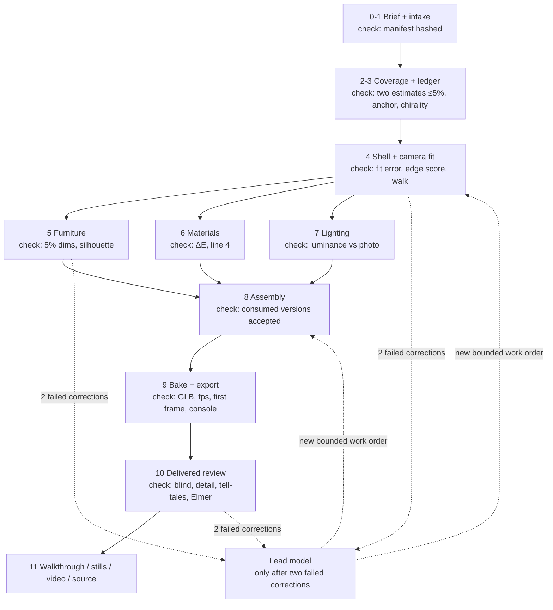

# 3D property factory

A repeatable production line that turns listing photos and a floor plan into a hyperreal, navigable browser walkthrough, with stills and video derived from the same scene. Every task has a written assignment, every result has acceptance evidence, and every worker can be replaced without touching the rest of the line.

This plan consolidates three sources: the Amsteldijk and Chalet Aline builds (what fails when a frontier model is the modeller), the bedroom-A campaign (`efesantos/aline-bedroom-a`, the working factory in miniature) and the Codex design session of 22–23 September 2026 (`design-3d-model-factory-chat-history.md`). Nothing described here is production-proven yet; bedroom-A's plumbing passes, its realism does not.

**The argument in one line.** The bedroom-A campaign ran every module on a real room for about US$2 of API spend and 1.5 Rodin credits. Amsteldijk spent 2.9 billion tokens for a 50/100 realism verdict. The difference is that tools did the pixels, code re-ran the checks, and the model only planned, wrote glue and critiqued.

## 1. Scope, deliverables and pass bar

### Scope

- **Inputs:** existing listing photographs and a floor plan. Nothing measured on site. Every dimension is tagged `measured | derived | inferred` with its source.
- **Approximation policy:** convincing approximation is allowed where evidence is missing, never contradiction of a known feature. Every object carries a certainty label. The delivered experience includes a photo-versus-render comparison for every fitted camera.
- **Deliverables from one accepted scene:** premium desktop browser walkthrough (primary), lighter mobile delivery, stills, a cinematic video cut, and the editable Blender source.
- **Out of scope for now:** capture-based reconstruction (splats), generated environments, GPU-streamed engines. Each is a separate route with its own qualification.

### The unit of work

The **connected suite** is the unit everything is qualified against: three connected rooms including the hardest case (a kitchen or bathroom with tile, glass and mirrors, or a room with a large window and a reflective floor) and the corridor that joins them. Bedroom A is the current test room; the bathroom is queued as the hard case.

### Pass bar (frozen; a release cannot lower it)

| Check | Requirement | Judged by |
|---|---|---|
| Camera fit | joint landmark fit with known heights fixed; held-out reprojection error at or below the bedroom-A floor (≈38 px at 1400 px wide) | code (`fit_joint.py`, `edge_score.py`) |
| Structure | one metric anchor per room; one chirality sentence per room; no dimension contradicts the plan | code + ledger review |
| Blind test | a critic and Elmer fail to pick the photo, or abstain, on at least one of two views | cross-vendor critic + Elmer |
| Materials and light | no line-4 violation named by the materials critic; tell-tale checklist all "no" (flat shading, plastic fabric, wrong colour temperature, missing reflections) | Gemini Pro critic |
| Detail crops | 512 px crops judged "close" or better | critic |
| Browser | 60 fps p5 on an Apple Silicon laptop at 1920×1080; first usable frame under 5 s cold; zero console errors; close views, reverse views and ordinary movement inspected, not just hero renders | code (`perf.js`) + visual review |
| Assets | generated furniture within 5 % of ledger dimensions; silhouette IoU passes | code (`silhouette_check.py`) |
| Provenance | every object labelled; every fitted camera has a photo-versus-render overlay; tokens per pool and credits recorded | code |

Resolution alone never passes. Attractive renders alone never pass.

## 2. The production line

Each stage lists the worker that does it today, what it must produce, and how the output is accepted. Every node has its own check; nothing moves downstream until it passes. The lead model is not a checkpoint; it is the exception path after two failed corrections.

| # | Stage | Worker today | Output | Accepted by |
|---|---|---|---|---|
| 0 | Brief | Elmer + conductor | rooms, routes, devices, deliverables, approximation policy | Elmer |
| 1 | Source intake | Python | hashed source manifest, provenance, resolution check, duplicates flagged | code |
| 2 | Coverage and inventory | Gemini 3.8 Flash | rooms, surfaces, openings, furnishings, each linked to a photo region; unseen areas marked unknown | code (every observation has a source) + Jev alias/class gates |
| 3 | Evidence ledger | Sonnet instrumented (`measure_plan.py`) cross-checked by Gemini with functions | `ledger.json` with tagged dimensions, uncertainties, chirality sentence, metric anchor | two estimates within 5 %, else escalate |
| 4 | Shell and camera fit | author slot: `build_shell.py` → `check_shell.py` → `render_cameras.py` → `fit_joint.py` | `room.blend`, `room.glb`, camera fit record, overlays | code: fit error, edge score, walk without clipping |
| 5 | Furniture and fixtures | library first; procedural cloth for soft furnishings; Rodin from cleaned crops for bespoke items | normalised GLB, dimensional report, six inspection views | code: 5 % dimensions, silhouette; critic on inspection views |
| 6 | Surface materials | CC0 PBR at physical scale + render-calibrated colour step | material assignments, ΔE report | code: ΔE threshold; critic line 4 |
| 7 | Lighting and look | recipe in `lighting.json` tuned against real albedos; Cycles on Metal | exposure matched to photo luminance, lamp budget | code: mean luminance vs photo; critic tell-tales |
| 8 | Scene assembly | Blender assembly script | assembled `.blend`, asset versions consumed recorded | code: all consumed versions accepted |
| 9 | Bake and browser export | `bake_lightmap.py`, glTF Transform, three.js viewer | lightmapped GLB, viewer bundle | code: `check_glb.py`, perf, console |
| 10 | Delivered experience review | critic packets (fidelity, blind, detail, ratchet) + Elmer blind judgement | verdict JSON, ratchet decision | pass bar above |
| 11 | Sales package | Cycles stills, video cut, provenance page | stills, video, "About this reconstruction" page | code + Elmer |

Rooms run stages 3–7 in parallel with each other once the ledger of each is accepted. Assembly waits for every asset version it consumes. Release waits for every check.

Human gates are exactly two: **shell accepted** (after stage 4) and **release accepted** (after stage 10). Everything else is automatic under the stop rule.

## 3. Workers and resource pools

### Worker roster

A worker is a role with a written method, limited inputs and outputs, allowed tools and a test that shows it does that one job well. Naming a general model "the materials agent" does not make it a specialist. Incumbents come from the bedroom-A matrix; every row is replaceable through the evaluator procedure in section 6.

| Role | Incumbent | Boundary |
|---|---|---|
| Conductor | Claude Fable in Claude Code, running `conduct.py` | plans, dispatches, re-runs acceptance, merges. Never authors geometry. |
| Author (Blender recipes, shell, repairs) | Sonnet via headless `claude -p`; Codex Astra when credits allow (`harness.json`, one line) | receives only a hashed HANDOFF note; runs acceptance commands; never grades quality; never calls a network API |
| Fidelity critic | Gemini 3.8 Flash ×3 (lines 1–3); Gemini 3.1 Pro (line 4 materials, detail crops) | different vendor from the author; sees only a frozen packet; never a camera gate |
| Experience critic | Opus in fresh context | second opinion on movement, close and reverse views |
| Conformance reviewer | headless Claude or Codex Astra at max | eleven-item rubric over the note, report, verification record and matrix row; no renders, no chat history |
| Structured judgement | Jev (TypeSafe) on its four adopted gates: alias, class, height band, handoff-note prose | text only; rejected for evidence-status audit; every new gate must pass the adoption rule |
| Vision inventory | Gemini 3.8 Flash | observations are evidence-linked proposals, never approvals |
| Geometry, cloth, bake, render | Blender 5.2 Python, Geometry Nodes, Cycles on Metal | the production machinery; agents write and repair recipes, scripts run them |
| Bespoke assets | Rodin Gen-2.5 (existing subscription); Tripo and Meshy as challengers | cleaned crops only; `--confirm-spend`; at most two charged attempts per asset |
| Materials and HDRIs | Poly Haven CC0 + qualified library | reuse an accepted asset only within its tested conditions |
| Browser delivery | glTF Transform, three.js viewer, `perf.js` | reuse the bedroom-A viewer contract |

Open-weights critics (Qwen3-VL, GLM, DeepSeek) made no stack in bedroom-A: cheaper or slower but they miss or return invalid answers. Qwen-Image stays a research candidate until its commercial licence is settled.

### Resource pools

Sessions do not move between properties. Each property is its own folder and repo; a worker session ends with its task. What is shared across properties, and therefore needs reservations, is:

- one heavy GPU job at a time (bake or Cycles render) on the M5 Max / 48 GB machine;
- one Blender instance per scene file;
- subscription usage windows (ChatGPT Pro, Claude Max), tracked per pool per attempt;
- third-party generation credits (Rodin, later Tripo or Meshy) and the OpenRouter balance.

Start with one property in production. Add a second only after the first connected suite is accepted and bake hours per room are measured. Capacity is set by the slowest constrained stage; if lighting needs more GPU hours per property than the machine supplies at ten properties a month, no number of classification workers changes that.

## 4. Operating rules

### Four records

| Record | Purpose | Bedroom-A equivalent |
|---|---|---|
| Task definition | reusable specification of one job and its acceptance criteria | role cards + acceptance commands |
| Work order | that task for one property with immutable input hashes, recipe version, worker, resource class, spend limit | HANDOFF note |
| Attempt | one execution with the recorded worker configuration, pool, cache state, timing | dispatch + verify records |
| Result | artifacts by hash, checks, cost, uncertainties, acceptance decision | child report JSON + matrix row |

Each task definition contains: objective and boundaries; required inputs and prerequisite approvals; output artifacts and permitted modifications; the professional method, references and executable recipe; the prompt template or command; measurable requirements and visual acceptance criteria; allowed tools, resource requirements and limits; failure diagnosis, retry limit and escalation conditions; upstream dependencies and downstream consumers.

For an LLM attempt, keep the template and the exact populated note, input hashes, supplied skills and tool configuration. For deterministic workers, keep the executable version, command, parameters and inputs. Do not add an LLM to a node just to give it a prompt.

Example, furniture conditioning: *Normalise this approved chair asset to the supplied dimensions and coordinate system. Preserve silhouette and material assignments. Modify only the designated output. Produce the conditioned model, a dimensional report and six inspection views. Flag missing geometry or ambiguous proportions; do not invent a replacement.* Its numeric checks and inspection views are defined before it runs; a clean script exit alone accepts nothing.

### Skills are written down and versioned

The know-how for each craft (reference analysis, camera and scale fitting, architectural construction, asset conditioning, cloth, UVs, materials, lighting, realtime conversion) lives in git as files: a decision procedure, the scripts, accepted and rejected examples, known limitations. Every attempt records the skill version it used, the same way code records a library version. When a result changes, this is how you tell whether the model changed or the instructions changed. An improvement is a new version; existing builds keep theirs.

### Controller and lead model, plainly

**The controller** is a Python program with no model inside it. It reads the ledger, finds tasks whose inputs are all accepted, reserves resources, launches the command for each, enforces budgets and retry limits, re-runs acceptance commands, and writes what happened. It never judges quality. It is `conduct.py` promoted from one room to a property.

**The lead model** is a model session the controller invokes in three situations only: a task has failed two corrections; a brief contains something no recipe covers; a worker proposed a workflow change that needs a decision. It writes a reassessment (what was disproved, what remains plausible, what new evidence or method is needed) and a new bounded work order. It does not run the line and is never in a live monitoring loop.

### Who checks, who diagnoses, who fixes

| Question | Answer |
|---|---|
| Did the task meet its criteria? | Never the worker that did it. The controller re-runs deterministic checks. A critic on a different vendor, in fresh context, seeing only the frozen packet, judges appearance. |
| What went wrong? | The critic names the single biggest violation with evidence (view, measurement, criterion). It does not propose a fix. |
| Who fixes it? | Attempts 1 and 2: the same worker, given the critic's findings. After two failed corrections the task stops and goes to the lead model. |
| Who decides the method change? | The lead model proposes; the controller dispatches; Elmer is consulted only if scope or spend above threshold changes. |
| Can a critic gate a release? | Not until it is calibrated: it must catch most seeded sabotages on a clean set that already passes checklist lines 1–3. Cameras are gated by geometry, never by a critic. |

### Rules the line enforces

- One writer per mutable artifact; accepted versions are immutable; corrections create new versions and invalidate affected downstream work. Unrelated accepted work stays reusable.
- Builder vendor differs from fidelity-critic vendor.
- Children receive only the hashed note; isolation probes (loaded skills, env keys, secret nonce) run on every dispatch.
- Third-party generation needs `--confirm-spend`; at most two charged attempts per asset; provider job ID saved before polling so a crash never buys the same generation twice.
- Service failures retry separately from quality failures.
- Subscription exhaustion pauses the worker. Never silently switch to API billing. OpenRouter only for Gemini and allow-listed open-weights models; Claude in Max; Astra only through Codex.
- Silent fallbacks are the costliest failures (Cycles on CPU, rate limits). Every run writes a ledger row with pool, seconds, cost and the primary metric; a heartbeat loss means "unconfirmed", not "failed".
- One metric anchor and one chirality sentence per room before the shell is built. Clean the crop before any generation spend.
- After two failed corrections, the next attempt requires new evidence or a changed method.

States shown distinctly: waiting for dependencies, ready, executing, waiting for provider or resource, awaiting review, accepted, needs revision, failed, cancelled, superseded. "Waiting for approved shell", "waiting for GPU" and "waiting for Rodin" are different conditions, not one "blocked".

## 5. Visibility

No custom dashboard. Three pieces cover the need to understand the plan and see where things stand:

1. **The ledger is the truth.** SQLite with an append-only events table, promoted from `matrix.csv`. Holds prompts, hashes, attempts, costs per pool, artifact previews. Reconstructs status after restart.
2. **The plan view is generated from the task definitions.** A script renders the definitions in git into a static page: the diagram in section 2, and for each task its objective, exact prompt template, criteria, skill version, inputs, dependencies and downstream consumers. Same pattern as bedroom-A's `campaign-explainer.html`. The documented workflow and the executed workflow cannot drift because they are one set of files.
3. **Status lives in Linear.** One issue per work order, never per attempt; states mirror the ledger's; labels for property and stage; the controller syncs one way, ledger to Linear. Both Codex and Claude Code read it through the Linear MCP. Check whether the free plan's 250-issue limit is monthly or total active before committing; fallback is GitHub Issues + Projects, which has no cap and matches the repo-per-property layout.

Closing any of these must not stop production. Nothing in them can dispatch work or approve results.

## 6. Evaluator role

A dedicated role with its own task definitions and budget, run by the controller on triggers, not a standing agent. Its output is a recommendation; promotion is a separate decision.

**Triggers:** monthly during active production; immediately after a new model release, a deprecation, a compatibility change or a production regression.

**What is evaluated:** a whole configuration, `model + effort + prompt + skill + tools + limits`. Effort names are not comparable across models; a fresh effort sweep is needed per model. A smaller model is not automatically cheaper per accepted task.

**Procedure** (the bedroom-A adoption rule, generalised):

| Stage | Method | Decision |
|---|---|---|
| Evidence screen | model card, evaluations, modalities, availability, migration needs | credible candidate for this role? |
| Frozen cases | incumbent and at most two challengers on three frozen cases from the case bank; hold tools and assets constant; reuse recorded generator outputs so an LLM comparison never repurchases a Rodin job | eliminate clear failures |
| Limited production trial | three eligible work orders through the candidate with full review and rollback | qualify for that role and task class |

Add held-out cases (six previously unused, including another property) only once the ledger shows what a case costs.

**Case bank.** Harvested now, for free, from the existing repos: the Amsteldijk 50 cm clear-width error, the mirrored bedroom-A ledger, the three Rodin assets that missed the 5 % bar, the four bedroom-A sabotages (ceiling +15 %, wardrobe removed, bed mirrored, camera yaw +10°), the seven boot-door versions and slab textiles from Chalet Aline, the ten good and ten bad handoff notes in `docs/truth/`. Development and held-out cases kept separate.

**Recorded per attempt:** first-attempt and eventual acceptance; critical defects, visual quality, missed sabotages; execution latency separate from queue time; tokens, provider charges and pool usage; retries, tool costs, review effort, downstream repair; exact conditions including cache state. Blind comparisons where practical. Code establishes facts; visual review judges appearance; a model critic is never the sole authority.

**Promotion rule.** All critical requirements pass; no observed material regression on the frozen cases; a meaningful quality gain or at least a 20 % reduction in measured cost or latency without worsening the other constraints. Small or uncertain differences keep the incumbent. Promotion applies to one role and task class, at explicit boundaries, with the previous configuration preserved for rollback. Active builds keep their configuration.

**Budget.** €15 a month cash within the existing €150 additional-spend ceiling, and 10 % of agent execution time, tracked per pool. Stop when either is exhausted; leave the candidate unqualified. Investment test: a €12 evaluation that saves €0.40 per accepted task breaks even after 30 tasks; where the saving is subscription capacity, report saved time separately.

**Current queue.** GPT-6 Sol and Claude Opus 5.5 (both reported released 22 September 2026; not independently verified here) enter as candidates for the author role at medium effort against the recorded Sonnet baseline; low effort tested on the winner; effort raised only when failures show insufficient reasoning. The open Fable-versus-Astra question for conducting is settled the same way on the frozen cases, not by preference. Jev's rejected status-audit gate is re-evaluated only under policy v2 with the multi-file deliverable fix.

**Jev is not a foundation.** It is a candidate for narrow typed judgements over text: converting critic prose to structured verdicts, classifying failure causes, gating on stated thresholds. It reads no images and it missed the one real mislabel in bedroom-A. Every gate it takes must pass the adoption rule: accuracy at or above the code path at ≥ 85 % coverage, not Pareto-dominated, a no-match outcome, respects the failure taxonomy.

## 7. Sequence and acceptance

Ordered by what unblocks the most. The factory is not built ahead of a room that passes the pass bar.

1. **Bedroom A passes the blind bar.** Lighting re-tune against real albedos (≈20× light budget, exposure matched to photo luminance ≈0.21), curtains as cloth, a window view instead of white sky, headboard and lamps from clean crops, metric anchor for the width. Re-run the perceptual packets, then the four sabotages on Cycles renders to calibrate the critics. Needs from Elmer: one known real dimension; the next blind judgement.
2. **Bathroom as the hard case.** Tile, glass, mirrors through the same scripts. Bedroom B camera fit and critic round as regression.
3. **Promote the controller.** `conduct.py` and `matrix.csv` become a property-level controller with the SQLite ledger, resource reservations, provider-job persistence and the Linear sync. Task definitions and skills move to versioned files; the plan view renders from them.
4. **Connected suite pilot.** Three rooms and the corridor through the controller, end to end, measured: bake hours per room, tokens per pool, credits, wall clock, corrections, which pool hit a window. Release only against the pass bar in section 1, judged in the delivered browser with close, reverse and moving views.
5. **Evaluator on the pilot's cases.** First comparisons: author role (Sonnet baseline vs Sol vs Opus 5.5; Astra when credits return), conductor (Fable vs Astra), critic (Flash ×3 vs Pro), Jev policy v2.
6. **Second property.** Demonstrate reuse of recipes and assets, scheduling across resource pools, recovery from a crash, and the true cost and time per accepted property, before any claim about 5–10 properties a month.

**Acceptance for the factory itself:**

- A task can be traced from source hashes through its note, attempt and accepted output.
- Independent work runs concurrently; dependent work waits on the right condition, shown distinctly.
- A crash or reconnect never duplicates a paid job.
- Failed attempts stay inspectable; after two failed corrections the next attempt carries new evidence or a changed method.
- Changing an input identifies and invalidates exactly the affected outputs.
- A restart reconstructs status from the ledger; missing telemetry is visible, not hidden.
- Nothing in the plan view or Linear can dispatch work or approve results.
- Comparisons preserve conditions, record every attempt and respect both budgets.
- A promoted worker rolls back without corrupting accepted artifacts.
- Visual acceptance is judged in the delivered browser, including close, reverse and moving views.
- Cost and elapsed time are reported per accepted room and per accepted property, queue time separate from processing, and compared against the Amsteldijk baseline (target under 5 % of its token volume).
