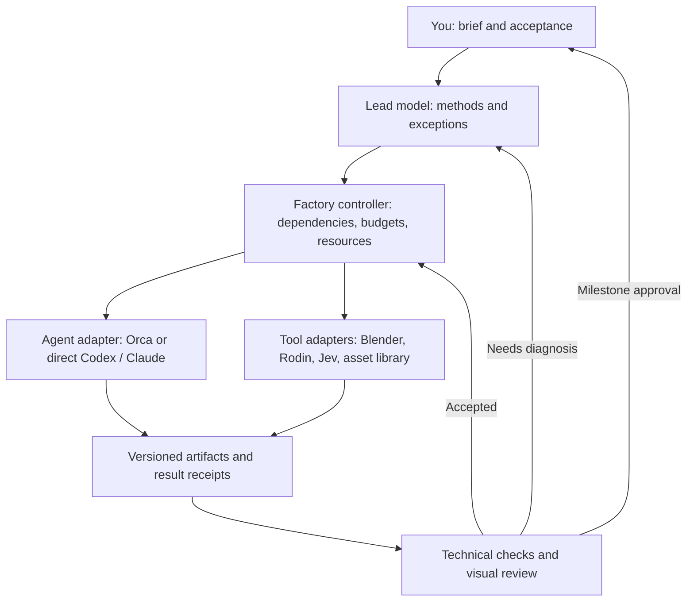
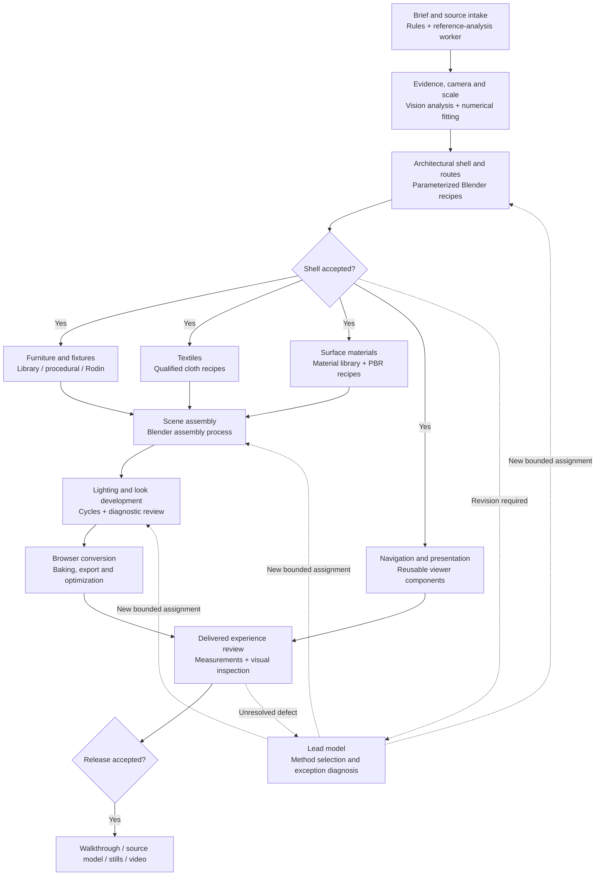

# Chat history: Design 3D model factory

> Exported from the Codex session “Design 3D model factory”. Internal instructions, tool calls, and tool outputs are omitted; user and assistant conversation text is preserved.

## User

<recommended_plugins>
Here is a list of plugins that are available but not installed.

- Box (box@openai-curated-remote)
- Databricks Genie (databricks@openai-curated-remote)
- Figma (figma@openai-curated-remote)
- Gmail (gmail@openai-curated-remote)
- Google Drive (google-drive@openai-curated-remote)
- Outlook Calendar (outlook-calendar@openai-curated-remote)
- SharePoint (sharepoint@openai-curated-remote)
- Slack (slack@openai-curated-remote)
- Snowflake (snowflake@openai-curated-remote)
- Teams (teams@openai-curated-remote)
</recommended_plugins>

# AGENTS.md instructions

<INSTRUCTIONS>
# Global instructions

Personal context for all projects (background, goals, working style). Treat it as preference and context, not as overriding the current task.

@/Users/elmersantos/Desktop/AI Master Folder/ABOUT_ELMER.md

If the block above is only a path and not expanded profile text, read `/Users/elmersantos/Desktop/AI Master Folder/ABOUT_ELMER.md` (or `~/.codex/ABOUT_ELMER.md`) before substantive work.
</INSTRUCTIONS>

<environment_context>
  <cwd>/Users/elmersantos/Documents/ChatGPT/3d factory</cwd>
  <shell>zsh</shell>
  <current_date>2026-09-22</current_date>
  <timezone>Europe/Amsterdam</timezone>
  <filesystem><workspace_roots><root>/Users/elmersantos/Documents/ChatGPT/3d factory</root></workspace_roots><permission_profile type="managed"><file_system type="restricted"><entry access="read"><special>:root</special></entry><entry access="write"><path>/Users/elmersantos/Documents/ChatGPT/3d factory</path></entry><entry access="write"><special>:slash_tmp</special></entry><entry access="write"><special>:tmpdir</special></entry><entry access="write"><path>/Users/elmersantos/.codex/visualizations/2026/09/22/01a0ca5d-d18a-7dd0-a522-4d0d00319e7d</path></entry><entry access="read"><path>/Users/elmersantos/Documents/ChatGPT/3d factory/.git</path></entry><entry access="read"><path>/Users/elmersantos/Documents/ChatGPT/3d factory/.agents</path></entry><entry access="read"><path>/Users/elmersantos/Documents/ChatGPT/3d factory/.codex</path></entry></file_system></permission_profile></filesystem>
</environment_context>

## User

I want to create a 3D model factory. The context is that I've been trying to use ChatGPT, Astro, and/or Claude Fable to use Blender and perhaps a few other tools in order to create 3D models of properties, mostly. I was led to do this by a lot of demos that people put online of these models being capable of doing that. These models can create 3D assets and impressive 3D models of properties, buildings, etc. However those are mostly demos.

I think that they are going viral because they allow people who are not part of the industry and don't know how to create assets, etc., to do that easily. Those LLM models were driving the entire process and sometimes using Blender and computer use, and it felt magical. For my purpose, which is to sell these services at scale, these may not be the best approach: relying on the model to drive everything and to let the model decide and conduct the entire pipeline.

One reason is that you probably can do it but it's not going to be very efficient. Also it's not going to be consistent: how do I ensure that certain steps are taken and so on? Now I'm thinking that I need to approach this as a factory. The concept is that we're going to have an origin, a start of the project, which probably is just photos or a plan of the property, and then an end state, which is the 3D model, which can have a few different form factors:

- the 3D model
- a navigable asset
- a video
- a hyperrealistic asset
- a sort of game where the user can interact and walk around

You can have different form factors, but we need to go from A to B. For that, I want to break down the steps in a lot of detail. I want to know what exactly is necessary to go from A to B, and I want specialized agents and/or tools to take care of each step with the frontier model, just orchestrating and doing what is best: planning, orchestrating, checking quality, etc. Certain things that it does better than the others. The different tasks should be done by specialized tools and agents or processes, etc., so I want to break down those tools.

I want these to really be like a factory where each worker is very specialized and does one thing and does it very, very well, so that they do it at scale. For example, to create 3D assets, instead of creating them from scratch with ChatGPT Ashra, for example, we would use tools such as Rodin or Meshy or Tripo, something like that. For classification, we might use Jeff. For image generation, we might use Gemini or the new ollama qwen image 2.1.

I want a plan for how to break down this process and then which tools, which agents, which models, and which software should be responsible for what. There may be more than one way of approaching it:

- First break down the tasks and then choose the best workers for the task. In this sense, the tasks are the most important things, and then we choose the best workers.
- Look at all the workers that are available and feed the task around those workers.

I don't know which approach is best, but I want to explore that. I want you to explore how the process could be broken down into different ways, and then what the different combinations of workers would be. I want you to explore the different workers that may be there and how they would suit the tasks.

It is crucial that the output is of very high quality. It needs to be hyper-realistic. It needs to feel like an immersive experience, something that the user looks at and really sees and senses or understands what the property looks like. Even if it is a game or a 3D asset, it would have to be as close as possible to a very, very high-definition video.

I will be relying on my ChatGPT subscription, which is the Max 20, and on a Claude subscription, which is the Max. If it is justifiable, I can pay for API tokens for other models, such as Qwen or Gemini, Jev, etc., if it makes sense that those are included in the pipeline. Also, certain tools: right now I have a subscription to Rodin, and if it is crucial, I can get a subscription to one or two more.

The idea is that I'm going to have a pipeline of these projects, and workers would be busy with them. Even if a worker has finished his task for property A, but then property A is not finished yet, that worker can start working on that same task for property B, and so on. Maybe there's a way of us storing certain scripts and assets and so on so that they can be reused.

Look at the learnings from:

- the Amsteldijk project [https://github.com/efesantos/Amsteldijk-Zuid-203-A-model](https://github.com/efesantos/Amsteldijk-Zuid-203-A-model)
- from Chalet alline [https://github.com/efesantos/challet-alline](https://github.com/efesantos/challet-alline)
- chalet alline A [https://github.com/efesantos/aline-bedroom-a](https://github.com/efesantos/aline-bedroom-a)

## Assistant

I’ll start with the three projects and their recorded lessons, then research how the available tools fit into a repeatable production pipeline. The key is to define what each stage must deliver—and how we verify it—before deciding which model or tool should do the work.

## Assistant

I’m using the OpenAI Docs and TypeSafe skills to check subscription-based orchestration and Jev’s potential role. The earlier project notes point to an important issue to verify: attractive renders and successful exports sometimes passed while the actual walkthrough still had visible defects. That means quality checks need to follow the delivered experience, including movement and close-up views.

## Assistant

The bedroom-A repository already contains a useful prototype of this factory: separate stages for evidence, geometry, Rodin assets, Jev checks, visual criticism, baking, and orchestration.

Its results also reveal where the design needs work. The pipeline ran successfully, but realism failed; the room width remained uncertain; and all three generated furniture assets missed their proportion targets. My starting recommendation is therefore **task-first design, with tools competing for clearly defined jobs**. We can reuse the working pipeline contracts while testing better workers and better inputs.

Three choices will substantially change the factory design.

## Assistant

I’ll design around existing photos and plans, browser delivery, and you approving milestones while agents do the production work.

The bedroom-A results suggest a useful split: code should enforce measurements, file contracts, scheduling, and repeatable processing; models should interpret evidence, handle exceptions, and critique appearance. Jev helped with narrow text classifications, but its evidence-status check missed a real error. Likewise, the visual critics were not reliable enough to certify camera alignment. Those jobs need different checks.

## Assistant

The tool comparison is separating into three viable routes: reconstruct the property as editable geometry, reconstruct a captured scene from sufficiently dense photos/video, or generate a plausible environment. The last route can look impressive, but it cannot establish what unseen parts of the real property look like.

For your chosen inputs, I’m leaning toward editable geometry with reusable asset and material libraries, selective Rodin generation, and baked lighting for browser delivery. I also verified your Mac’s M5 Max/48 GB configuration; local image generation, baking, and rendering will need a shared resource queue rather than running unrestricted alongside each other.

## Assistant

Your choices point to a shared production core for sales and rentals, with convincing approximations allowed and a target of 5–10 properties per month. I’ll treat that throughput as something the pilot must demonstrate; the existing projects do not yet establish it.

One concrete finding changes the tool shortlist: Qwen-Image-2.1’s published weights currently require a separate licence for commercial use. I’ll keep it as a research candidate and use Gemini image editing in the proposed commercial baseline. For 3D generation, Rodin remains the starting worker; Tripo is a low-cost challenger to test, while Meshy should earn an additional subscription through measured results.

## Assistant

<proposed_plan>
# A property-model factory built around verified production stages

## 1. Recommended approach

Build a **task-first factory with replaceable workers**, then improve it through controlled tool comparisons.

The process should define what must be produced, what evidence each worker receives, and how its output is accepted. Tools compete within that structure. A new tool can justify changing the process when it demonstrably removes work or improves quality.

The strongest frontier models should design recipes, interpret ambiguous evidence, diagnose difficult failures, and review milestones. Once a recipe works, ordinary code should execute it repeatedly.

Your chosen starting point is:

- Existing photographs and floor plans.
- A premium desktop browser walkthrough, with a lighter mobile experience.
- Convincing approximations of furnishings and finishes where necessary.
- Agents performing production; you approving consequential visual milestones.
- One production core serving property sales and luxury rentals.
- Existing ChatGPT, Claude, and Rodin subscriptions, plus a **€150 monthly additional spending ceiling**.
- A connected-room pilot, followed by qualification toward **5–10 properties per month**.

That throughput is a target to test. None of the three projects currently proves that hyperrealistic whole-property production is repeatable at that rate.

### What the earlier projects establish

These findings come from their current repository records and selected implementation files; I have not rerun their visual experiments.

| Project | Useful evidence | Consequence for the factory |
|---|---|---|
| **Amsteldijk** | The desktop pilot appearance was accepted, but the repository explicitly distinguishes that from passing the original hyperrealistic benchmark. Its entry assets totalled about 259 MB, with performance qualification still incomplete. | Set delivery budgets early. Test the actual walkthrough before multiplying assets, lighting variants, and rooms. |
| **Chalet Aline** | The working branch still records an active connected-area quality gate, with later gates pending despite numerous successful component checks. | Component success must feed into a separate assembled-experience acceptance test. |
| **Bedroom A** | Reusable shell generation transferred to bedroom B without code changes. Orchestration worked, but realism failed; dimensions remained uncertain, generated assets missed proportion targets, and critics missed deliberately introduced defects. | Reuse the contracts and scripts. Requalify the workers and quality checks. |

Sources: [Amsteldijk release record](https://github.com/efesantos/Amsteldijk-Zuid-203-A-model/blob/main/README.md), [Aline working state](https://github.com/efesantos/challet-alline/blob/codex/ground-floor-foundation/docs/CURRENT-STATE.md), [bedroom-A campaign](https://github.com/efesantos/aline-bedroom-a/blob/main/docs/CAMPAIGN.md).

The bedroom campaign’s explanations—such as lighting being the principal realism bottleneck or poor crops causing asset failures—are useful hypotheses. Controlled comparisons should establish how much each factor contributes.

## 2. Alternative production routes and worker combinations

There are two separate architectural choices: **how to reconstruct the property** and **how to deliver it**. Changing the renderer cannot repair missing source evidence or incorrect geometry.

| Route | Worker combination | Strength | Limitation and decision |
|---|---|---|---|
| **Editable reconstruction** | Evidence extraction → constrained Blender geometry → library/procedural/generated assets → materials and lighting → Three.js | Editable, reusable, supports multiple deliverables and selective corrections | Requires careful reconstruction. **Recommended baseline for your inputs.** |
| **Capture-based reconstruction** | Overlapping photos/video → COLMAP or RealityScan; Gaussian-splat reconstruction → SuperSplat/PlayCanvas | Can preserve considerable photographed appearance | Requires suitable coverage. A handful of listing photographs is not equivalent to a capture sequence. Keep as an alternative when clients supply sufficient material. |
| **Generated environment** | Marble/world model → exported splats or meshes → browser experience | Rapid creation of convincing environments | Unseen content is generated rather than verified. Suitable for explicitly illustrative experiences; exclude from the faithful-property baseline. |
| **Offline-rendered presentation** | Same Blender master → Cycles stills, video, panoramas → browser presentation | More rendering time per frame; attractive mobile delivery | Panoramas restrict movement. Use as a derivative product and mobile presentation. |
| **GPU-streamed walkthrough** | Reconstructed scene → Unreal → Pixel Streaming | Moves demanding rendering onto a remote GPU | Adds hosting, concurrency, latency, and operating costs. Keep outside the initial €150 stack. |

COLMAP documents the importance of overlapping views and the difficulties posed by untextured and reflective surfaces. SuperSplat supports browser delivery with collision data. Marble exports generated worlds, while Unreal Pixel Streaming renders remotely and sends an interactive video stream. [COLMAP](https://colmap.github.io/tutorial), [SuperSplat](https://developer.playcanvas.com/user-manual/supersplat/), [Marble](https://www.worldlabs.ai/blog/marble-world-model), [Pixel Streaming](https://dev.epicgames.com/documentation/unreal-engine/overview-of-pixel-streaming-in-unreal-engine).

### Proposed worker roster

| Worker | Initial responsibility | Selection rationale and boundary |
|---|---|---|
| **Claude Fable, through your subscription** | Production planning, exception handling, coordination at milestones | Reuse the bedroom project’s conductor approach. Routine queue management belongs in code. |
| **GPT-6 Astra, through Codex** | Difficult spatial reasoning, developing Blender recipes, diagnosing appearance failures, independent milestone review | Use bounded assignments where judgment matters. Avoid keeping it in a continuous monitoring loop. |
| **Claude Sonnet / Codex Sol or Luna** | Implement specified adapters, scripts, tests, and routine corrections | Promote a worker only after it passes the relevant stage benchmark. |
| **Gemini 3.8 Flash** | Photo inventory, object descriptions, initial visual criticism | Treat observations as evidence-linked proposals. Escalate difficult visual judgments to Astra or a stronger Gemini reviewer. |
| **Jev** | Canonicalising object names and narrowly defined semantic checks over text | Never use it for image inspection, arithmetic, hashes, or final realism approval. Its current input is text. |
| **Blender Python, Geometry Nodes, Cycles** | Geometry, cloth, assembly, materials, lighting, baking, rendering | This is the core production machinery. Agents develop and repair recipes; scripts run them. |
| **Rodin** | Bespoke assets that cannot be obtained efficiently from the library or procedural recipes | Start with the subscription you already have. Require isolated inputs and inspect all sides. |
| **Tripo** | First challenger to Rodin | Benchmark through metered API usage before adding another recurring subscription. |
| **Meshy** | Second challenger; generation, remeshing, or texturing where demonstrated useful | Consider a subscription only if it wins a recurring task. |
| **Poly Haven + a qualified asset library** | Materials, HDRIs, reusable furniture and props | Reusing an accepted asset may save more total work than generating another one. |
| **SAM 3; Gemini image editing** | Object masks and, where needed, cleaned generation inputs | Preserve originals. Generated repairs are production aids, not new property evidence. |
| **glTF Transform + Three.js + browser tests** | Optimisation, delivery, navigation, performance and interaction checks | Reuse the existing delivery stack while simplifying its production contracts. |

This allocation is a proposed operating policy, not a claim that one model universally outperforms another. Current documentation supports the relevant [Astra](https://developers.openai.com/api/docs/models/gpt-6-astra), [Claude](https://platform.claude.com/docs/en/models/overview), [Gemini](https://ai.google.dev/gemini-api/docs/models/gemini-3.8-flash), and [Jev](https://docs.typesafe.ai/concepts/state) capabilities.

Three tool-selection details matter:

- **Rodin, Meshy, and Tripo need the same asset benchmark.** Compare accepted output after cleanup, texturing, integration, and review—not their showcase images. Rodin supports multiple input images; Meshy supports multi-image generation; Tripo offers metered generation and processing. Their credit systems are different. [Rodin](https://docs.hyper3d.ai/en/api-specification/rodin-gen2-5), [Meshy](https://docs.meshy.ai/en/api/multi-image-to-3d), [Tripo](https://developers.tripo3d.ai/en/pricing).
- **Qwen-Image-2.1 remains a research candidate.** Its published weights currently require a separate commercial licence. I did not establish official Ollama support. Use Gemini image editing in the commercial baseline. [Qwen licence](https://huggingface.co/Qwen/Qwen-Image-2.1/blob/main/LICENSE), [Gemini image editing](https://ai.google.dev/gemini-api/docs/image-generation).
- **Specialist software must justify its place.** Substance Sampler is a candidate when converting photographed surfaces into material maps becomes a repeated bottleneck. TRELLIS.2 is an experimental asset-generator challenger. D5 requires Windows, and Twinmotion’s path tracer currently requires Windows, making neither a natural first addition to your Mac-based factory. [Sampler](https://experienceleague.adobe.com/en/docs/substance-3d-sampler/using/filters/tools/image-to-material), [TRELLIS.2](https://microsoft.github.io/TRELLIS.2/), [D5](https://www.d5render.com/specs), [Twinmotion](https://dev.epicgames.com/documentation/twinmotion/path-tracer-requirements-for-twinmotion).

## 3. The production line: inputs, workers, outputs, acceptance

Each row is a specialised production responsibility. It does **not** require a permanently running agent.

| Stage | Work and responsible worker | Required output and acceptance |
|---|---|---|
| **1. Product brief** | Fable translates the customer’s purpose into rooms, viewing routes, devices, deliverables, and approximation policy. | Approved brief with explicit inclusions and exclusions. Sales and rental presentation templates share the same production scene. |
| **2. Source intake** | Python imports originals, records provenance, hashes files, extracts available metadata, and checks resolution and duplicates. | Immutable source manifest; missing or unusable material identified. |
| **3. Coverage map** | Gemini inventories rooms, visible surfaces, furnishings, openings, and connections. | Every observation links to a photograph or plan region. Unseen areas stay marked unknown. |
| **4. Evidence ledger** | Model-assisted interpretation plus numerical tools records dimensions, relationships, material descriptions, and uncertainty. Jev normalises terminology. | Measured, derived, inferred, and synthetic information remain distinguishable. No unsupported precision. |
| **5. Layout and camera solving** | OpenCV/SciPy fitting and constrained geometry; Astra handles ambiguity. Check scale, left/right orientation, lens assumptions, and room adjacency. | Consistent coordinate system, fitted cameras, documented residuals, and scale confidence. An assumed furniture size cannot masquerade as a measured anchor. |
| **6. Architectural shell** | Blender scripts generate walls, floors, ceilings, openings, stairs, and fixed joinery. | Correct topology and visible openings; no duplicate surfaces; continuous room connections. |
| **7. Early walkthrough** | Three.js loads the unfurnished shell. Automated routes test doorways, stairs, reverse movement, and ordinary camera positions. | You approve layout and viewing scope before detailed furnishing. |
| **8. Asset specification** | An asset planner records each object’s dimensions, silhouette, material, visual importance, and permissible approximation. | A bill of assets with a chosen acquisition route per object. |
| **9. Asset acquisition** | Route to approved library → procedural recipe → Rodin. Use a challenger only where qualified. | Candidate asset with provenance, licence, source inputs, and known departures from the reference. |
| **10. Generation-input preparation** | For generated assets: crop at original resolution, segment the object, remove neighbouring objects, and select genuine alternate views. | Mask/crop review passes before a charged generation. Synthetic alternate views are explicitly marked. |
| **11. Asset conditioning** | Blender scripts normalise units, axes, origin, proportions, normals, UVs, materials, and collision proxies. | Turntable and close-up inspection; asset loads correctly in the actual browser renderer. |
| **12. Soft furnishings** | Reusable cloth and procedural recipes create beds, curtains, cushions, and throws. | Convincing folds, thickness, contact, and silhouettes from ordinary and reverse views. |
| **13. Surface materials** | Qualified PBR library materials first; source-derived materials where needed. Scripts apply physical texture scale. | Correct grain direction, roughness, colour handling, repetition, seams, and material response. |
| **14. Scene assembly** | Code places accepted assets using stable IDs and the scene specification. | No floating objects, collisions, blocked routes, or obvious proportion errors. |
| **15. Lighting calibration** | Cycles recipes plus a lighting specialist agent establish daylight, practical lights, exposure, and reflections. | Appearance judged using final materials. Exposure, albedo, illumination, and display transformation are diagnosed separately. |
| **16. Browser lighting transfer** | Bake static lighting; add bounded reflection and transparency treatments; compare browser and native views. | The browser preserves the accepted appearance during movement. Lighting is not counted twice. |
| **17. Delivery optimisation** | glTF Transform and packaging scripts create room bundles, texture variants, and progressive loading. | Measured loading, frame times, memory behaviour, and visual regression pass. Optimisation cannot silently remove required UVs or details. |
| **18. Experience assembly** | A reusable viewer adds guided routes, free exploration, floor-plan navigation, room shortcuts, and factual hotspots. | Users understand where they are and how spaces connect. Initial release uses one qualified lighting/furnishing state. |
| **19. Independent quality review** | Numerical checks, browser tests, fresh-context visual critics, and your milestone review. | Separate verdicts for appearance, fidelity, usability, performance, and recoverability. |
| **20. Export and release** | Scripts produce the delivery packages, review evidence, manifests, and restoration instructions. | Published build matches the approved revision; a clean restoration succeeds. |

Two branches can run concurrently after shell approval: **asset production** and **surface/material preparation**. They converge at assembly and lighting. Rooms can also progress independently until connected-space checks require integration.

The default asset strategy should depend on the object:

- **Walls, cabinetry, stairs, repeated trim:** constrained procedural geometry.
- **Ordinary furniture and decor:** accepted library assets or convincing equivalents.
- **Distinctive sculptural objects:** image-to-3D generation.
- **Curtains, bedding, cushions:** reusable simulation/procedural recipes.
- **Thin fixtures, repeated symmetric objects:** procedural or library-first; single-image generation must prove it can recover their depth.

Poly Haven’s assets are CC0, including redistribution rights. Other libraries require asset-level checks appropriate to browser delivery and editable source handoff. [Poly Haven licence](https://polyhaven.com/license).

A generated texture image is also only one ingredient. It does not automatically provide a coherent set of base-colour, normal, roughness, displacement, and transparency maps.

### Deliverables from the same accepted scene

| Product | Export path |
|---|---|
| Editable 3D master | Blender scene, dependencies, source ledger, and regeneration recipes |
| Portable navigable asset | Qualified GLB package and scene metadata |
| Desktop property experience | Three.js guided tour and free exploration |
| Mobile presentation | Rendered panorama nodes, floor plan, hotspots, and optional video |
| Stills and video | Cycles renders using approved cameras and camera paths |
| More elaborate interactive experience | Additional interaction modules, each with its own visual and performance qualification |

“Hyperrealistic” is the quality requirement applied to these products. It is not an additional file format.

## 4. Scheduling, interfaces, reuse, and economics

### Factory software

Extend the bedroom-A prototype into a **Python pipeline with a persistent SQLite job queue**, rather than introducing a large workflow platform immediately. Keep the viewer in TypeScript/Three.js.

Provide local commands for `ingest`, `run`, `status`, `review`, and `export`, plus a dashboard showing jobs, blockers, spending, review packets, and accepted revisions. No customer-facing API is required for version one.

Use three versioned contracts:

| Contract | Minimum contents |
|---|---|
| **Property specification** | Sources, room graph, coordinate conventions, evidence ledger, target deliverables, approximation policy, and quality profile |
| **Work order** | Property/stage identity, immutable input hashes, recipe version, worker, output requirements, acceptance checks, dependencies, resource class, and spending limit |
| **Result receipt** | Output hashes, tool/model versions, actual provider job ID, checks, evidence, timing, charged cost, uncertainties, and status |

Workers return candidate results. Independent checks determine whether those results become accepted inputs for downstream stages.

Use these operating rules:

- One writer per mutable artifact; immutable accepted versions.
- Persistent states for queued, running, awaiting review, accepted, failed, and blocked jobs.
- Resource leases prevent conflicting work on the same scene or GPU.
- Save provider job IDs before polling. Resume an existing generation after interruption rather than blindly purchasing another.
- Retry service failures separately from quality failures.
- After two unsuccessful quality corrections, require a new diagnosis, input, worker, or representation.
- Changed inputs invalidate affected downstream outputs; unrelated accepted work remains reusable.
- Subscription exhaustion pauses the affected worker. Do not silently switch to paid API billing.

Codex supports non-interactive execution, while API billing remains a separate route. Subscription limits are shared capacity, so additional workers do not create additional allowance. [Codex automation](https://learn.chatgpt.com/docs/non-interactive-mode), [pricing and usage](https://learn.chatgpt.com/docs/pricing).

### Concurrency

Start with:

- Two properties in active production.
- One GPU-heavy local job at a time.
- Two simultaneous subscription-agent assignments overall.
- Up to two generation jobs per provider, further constrained by account limits and reserved spending.
- A single integration/release queue.

These are initial resource limits for the verified M5 Max/48 GB machine, to be adjusted using measured utilisation.

For example, while property A is baking, the evidence worker can prepare property B and Rodin can generate an asset for property C. A worker becomes available when its stage finishes; it does not remain attached to one property.

### Reusable inventory

Maintain separate libraries for:

- **Assets:** original source, licence, dimensions, materials, browser-ready variants, and approved use cases.
- **Recipes:** shell generation, cabinetry, cloth, UVs, material application, lighting, optimisation, and exports.
- **Experience components:** navigation, floor plans, guided tours, loading, and presentation templates.
- **Tests:** known-good scenes and deliberately broken examples.
- **Failures:** input conditions, symptoms, attempted corrections, and the method that eventually worked.

Reuse an asset’s qualification only within its tested conditions. A lamp accepted in the background is not automatically suitable for a close-up.

### Spending and capacity

Allocate the additional €150 monthly envelope initially as:

| Category | Ceiling |
|---|---:|
| Gemini, Jev, image editing, and challenger API experiments | €40 |
| Asset purchases or one demonstrably useful library subscription | €40 |
| Hosting, storage, and occasional remote compute | €20 |
| Rework and contingency | €50 |

These are proposed allocations, not vendor quotations. Existing subscriptions are outside this envelope; extra Rodin purchases count against it.

Track both:

1. **Incremental cash:** APIs, assets, compute, hosting, and additional credits.
2. **Full production cost:** allocated subscriptions, your review time, machine time, rework, and maintenance.

Report cost and elapsed time **per accepted room and accepted property**, with queue time separated from processing time. Do not convert notional API charges for subscription runs into actual expenditure.

Capacity is determined by the slowest constrained stage. If lighting requires more GPU-hours per property than the machine can supply at ten properties per month, adding classification agents will not solve the constraint.

## 5. Qualification and rollout

### Step 1 — Extract the working foundation

Reuse the bedroom project’s room ledger, shell contract, camera fitting, asset normalisation, bake/export path, handoff receipts, and experiment records.

Preserve the original projects as evidence. Extract reusable modules into the factory workspace with regression fixtures; avoid copying their accumulated experiments into the production path.

Correct the known weak points first:

- Scale assumptions and mirrored-room detection.
- Crop isolation before generation.
- Text-only Jev checks that incorrectly reject legitimate multi-file deliverables.
- Critics whose apparent success depends on the order of their checklist.
- Documentation that disagrees with newer run records.

### Step 2 — Prove one connected suite

Use Aline bedroom A, its connected corridor, and bathroom as the first qualification target. Bedroom B is the first recipe-transfer test.

The suite must exercise textiles, timber, glass, mirrors, small fixtures, window lighting, and room transitions. Qualify a complete route before extending to the rest of the property.

Run a bounded asset comparison on six representative objects:

- Cabinet/nightstand.
- Thin lamp.
- Upholstered chair.
- Headboard.
- Decorative object.
- A difficult irregular object.

Compare library/procedural baselines with Rodin and Tripo. Permit at most two charged attempts per generator/object. Test Meshy only on object classes where the initial routes remain inadequate.

Select workers by **quality pass first**, then total accepted-output cost, then elapsed time. Test station alternatives individually and integrate the winners; avoid an exhaustive combination of every model and tool.

### Step 3 — Apply explicit acceptance tests

| Dimension | Initial acceptance rule |
|---|---|
| **Geometry and evidence** | No source contradictions in room connectivity or major openings. Known dimensions meet the declared tolerance; inferred dimensions carry uncertainty. Approximations preserve the intended overall impression without adding unsupported amenities. |
| **Appearance** | Review at least 12 native browser viewpoints, six detail crops, and a continuous 90-second route. You rate geometry, materials, lighting, contact, and overall realism at least 4/5 each; unresolved major defects fail the gate. |
| **Movement** | Forward/reverse doorway travel, room revisits, close approaches, turning, and guided-to-free navigation work without clipping, holes, popping, or persistent flicker. |
| **Critics** | Seed isolated defects into otherwise acceptable scenes. Score each defect independently. Critics remain advisory until their false-pass behaviour is measured. |
| **Desktop performance** | Proposed target: 1920×1080, p95 frame time ≤22 ms during the route, first usable scene ≤5 seconds on a declared 50 Mbps/50 ms connection. Record five cold and five warm starts. |
| **Device coverage** | Test Chrome and Safari on the production Mac and a representative integrated-GPU laptop before claiming broad desktop support. Test the lighter mobile presentation on physical iOS and Android devices. |
| **Recovery** | Restore in a clean directory, verify all dependencies and hashes, rebuild the viewer, and load the accepted scene. |
| **Operational reliability** | Interrupt a worker, restart the scheduler, simulate provider failure, exhaust a budget, and change an upstream input. No lost accepted work, duplicate paid submission, or false release status. |

These numerical thresholds are proposed acceptance targets, not results already achieved.

Use blind photo comparisons as diagnostic evidence, not as the sole definition of realism. The previous two-view test is too small to establish general visual quality. The actual moving browser experience must pass separately from offline renders.

### Step 4 — Demonstrate transfer and overlapping production

Repeat the qualified recipes on an Amsteldijk connected area. Keep property-specific dimensions, asset choices, and material parameters in data rather than embedding them in scripts.

Run both properties through overlapping stages. Measure:

- First-pass acceptance rate.
- Number and cause of revisions.
- Your review minutes.
- Worker and GPU utilisation.
- Cost and turnaround.
- Reusable-asset hit rate.
- Failures caused by missing evidence versus inadequate tooling.

Only then extend to complete properties and validate the 5–10/month operating target.

If the suite fails the realism gate, return to the diagnosed production stage. If it passes visually but misses cost or throughput targets, optimise the measured bottleneck. The factory is ready to scale when it repeatedly delivers an accepted experience—not merely when every job in the queue finishes.
</proposed_plan>

<oai-mem-citation>
<citation_entries>
MEMORY.md:233-242|note=[production gates, independent review, and stop rules used to guide current repository research]
MEMORY.md:191-194|note=[frontier model task allocation and limits of visual inspection]
</citation_entries>
<rollout_ids>
01a09ad8-3469-7200-8b1d-39d2e4a9e7cc
01a0a004-e9be-7d70-8305-873be2631b59
</rollout_ids>
</oai-mem-citation>

## User

1. Why Claude Fable over GPT-6 Astro for planning and other tasks?
2. Will we use the computer-use tool and will there be Astro through Codex doing that?
3. Should we use a tool such as the Orca AI agent manager software to have different agents within one platform or is computer use through Codex enough? Explain to me clearly how the coordination will happen. 
4. I made this point previously but I want to reemphasize it because it is very important: it's the modularization and specialization of the workers.

A very good example is Jeff. Jeff is a new model that does classification very well but it doesn't do a lot that is new. Frontier LLM can do classification as well but because Jev specializes in it, it is orders of magnitude cheaper and faster. This is the approach that I want to take for the other tasks and modules: to find the right worker that will deliver things in a much, much more efficient manner than just having the frontier LLM build everything from scratch.

I also want you to look at the skills that would be necessary to develop this. The frontier LLMs already have that probably baked into their weights in terms of what a 3D artist would make and so on but it is not made explicit for this task. I want it to do so. I want you, or this process, or whatever model is driving the planning, to look at acquiring the skills and workflows of how a 3D artist would develop this.

I want to know exactly how they work: the steps they take, the workflows, how they would blend their different techniques and all of that, because I want these processes to have specialized agents. I don't want to just rely on the general very high capability of LM frontier models but I want them to bring in specialized knowledge and have that knowledge explicitly at the forefront of the process.

## Assistant

I’ll revisit the planner choice, make the coordination mechanism explicit, and research professional 3D workflows to define the workers more precisely. The earlier plan assigned Fable to planning because the bedroom prototype already used it—not because we had evidence that it plans better than Astra.

## Assistant

I’m also using the skill-creator guidance to define how that specialist knowledge should be packaged. Your distinction matters: naming a general model “the materials agent” does not make it an efficient specialist. Each worker needs an explicit method, limited inputs and outputs, suitable tools, and tests that show it performs that job well.

## Assistant

Orca’s documentation shows more than a side-by-side agent interface: it has tasks, dependencies, worker dispatches, completion messages, and decision gates, although that orchestration feature is marked experimental. It could manage the Claude and Codex workers. The factory would still need its own artifact checks, GPU allocation, spending controls, and quality decisions.

The professional workflow research also changes the skill design. Blender Studio explicitly separates modeling, shading, lighting, and publishing through owned task layers. That is a useful model for our workers: each should publish a defined contribution, rather than several agents editing the same scene freely.

## Assistant

**Your emphasis changes an important part of the design: the factory should be organized around professional production methods and specialized machinery. Agents operate that machinery, improve it, and handle exceptions.**

The previous proposal did not make that distinction strongly enough. Giving a frontier model a “materials specialist” prompt is useful, but it does not deliver the efficiency you mean by specialization.

**1. Why Fable rather than Astra?**

There is no established reason to prefer Fable for planning this factory.

My earlier allocation came from the working Claude conductor in the Bedroom A project. That establishes an integration advantage—not superior planning ability. The [Bedroom A campaign](https://github.com/efesantos/aline-bedroom-a/blob/main/docs/CAMPAIGN.md) is evidence about that implementation, not a controlled comparison between the models.

I would revise the allocation:

| Responsibility | Recommended allocation |
|---|---|
| Initial factory architecture, professional workflow synthesis, difficult diagnosis | Astra through Codex as the initial lead |
| Independent challenge of important designs and difficult failures | Fable |
| Routine production scheduling, retries, dependencies and budgets | Software |
| Repeatable production operations | Specialized tools and tested scripts |
| Narrow semantic decisions | Jev or another qualified specialist |
| Final visual acceptance | Evidence-based review, including your approval |

Choosing Astra initially is a practical default given this working environment and your preference—not a claim that it has beaten Fable.

We can compare them using the same frozen property brief: quality of decisions, missed constraints, downstream corrections, time to accepted output, and subscription consumption. We should not judge them by how convincing their plans sound.

Also, the lead model should be replaceable. Neither Astra nor Fable should become a dependency embedded throughout the factory.

**2. Will Astra use computer use through Codex?**

**Yes, where it serves the task.** This Codex desktop environment has a computer-use tool, and Astra can operate it.

Its appropriate jobs include:

- Inspecting the actual browser walkthrough, including movement and close views.
- Operating application features that lack reliable scripting interfaces.
- Diagnosing a discrepancy between the exported scene and what the application displays.
- Establishing a workflow that we subsequently convert into a repeatable script.

For routine geometry generation, material assignment, baking, exporting and file validation, we should normally use Blender’s Python interface and other application APIs or CLIs.

The distinction is between **discovering a method** and **repeating a method**. Astra might discover and validate a Blender procedure interactively. Once it works, a parameterized script should perform subsequent runs.

Computer use also needs a resource reservation: only one worker should control a shared desktop at a time. Other workers can continue headless operations when hardware capacity allows.

One important integration detail: a Codex CLI worker launched by another application does **not automatically inherit this desktop session’s computer-use tools**. We must explicitly provide and test its tool access.

**3. Orca versus Codex: they address different needs**

I am assuming you mean **[Stably’s Orca](https://www.onorca.dev/docs)**. Several products use that name.

Orca is more capable than a window containing several chats. Its documentation describes experimental orchestration with task dependencies, dispatch attempts, worker messages and coordinator decision gates. It supports launching Claude and Codex workers. It also has its own beta computer-use capability. Those are documented capabilities; I have not tested them on your machine. [Orca orchestration](https://www.onorca.dev/docs/cli/orchestration), [Codex integration](https://www.onorca.dev/docs/agents/codex), [computer use](https://www.onorca.dev/docs/cli/computer-use).

**My recommendation is to evaluate Orca as the agent console and dispatch layer, while keeping the factory’s production rules independent of it.** Codex computer use alone is insufficient for managing a production pipeline.

The coordination would work like this:

There are three distinct responsibilities:

| Layer | What it owns |
|---|---|
| **Factory controller** | Property status, required outputs, acceptance, spending limits and GPU/desktop reservations |
| **Agent manager—potentially Orca** | Starting agent sessions, delivering instructions, messages and execution status |
| **Production worker** | One bounded transformation, with specified inputs and outputs |

We should avoid two competing schedulers. The factory decides which production work is eligible. Orca, if used, manages the corresponding agent execution attempt. A report that an agent “finished” does not mean its asset passed acceptance.

For example:

1. Property A’s approved shell makes its furnishing tasks eligible.
2. The asset worker submits a chair job to Rodin and records the provider job ID.
3. While that generation runs, the worker can prepare Property B’s asset request.
4. A Blender process receives the completed chair, normalizes its dimensions and validates it.
5. Material work begins only after that asset version passes its checks.
6. Lighting waits for an approved scene version and available GPU capacity.
7. Failed checks either return a bounded correction or escalate a diagnosis to Astra.

No frontier model needs to remain awake narrating this sequence.

Before adopting Orca, the pilot should prove worker launch, completion reconciliation, interruption recovery, tool access and resource locking. Its orchestration is currently labeled experimental. Keeping an adapter boundary lets us use it without making the factory dependent on that experiment.

**4. Specialization should mean a different execution mechanism**

Your Jev example is exactly the right direction. However, we should distinguish four kinds of worker:

| Worker type | Example | Why it can be efficient |
|---|---|---|
| Deterministic software | Validate dimensions, resize textures, export a scene | No model inference or interpretation |
| Specialized model | Jev for a narrow semantic classification | Small, bounded judgment |
| Specialized application or algorithm | Camera solving, cloth simulation, UV packing, rendering | Encodes the domain operation directly |
| Frontier agent | Resolve conflicting photographs or diagnose an unfamiliar defect | Handles ambiguity that the established process cannot |

The default selection order should be:

**existing accepted result → deterministic operation → specialized tool/model → frontier reasoning.**

For instance, a known file extension requires code, not Jev. An ambiguous request such as “this furnishing is visually essential to the room’s identity” could require semantic judgment. Jev would need a calibrated task definition; its confidence would not establish truth.

Likewise, “generate a bed” is too broad a production task. It combines furniture structure, cloth, materials, dimensions and assembly. A more specialized combination could be:

- Parameterized frame and headboard geometry.
- A reusable mattress asset.
- Cloth simulation for duvet and pillows.
- A textile material recipe.
- A placement and collision check.

That combination might outperform whole-bed generation in both quality and correction time. It needs to be benchmarked rather than assumed.

Here is the worker map I would develop:

| Production task | Specialist to qualify first | Frontier model’s involvement |
|---|---|---|
| Reference inventory and semantic routing | Metadata rules, then Jev where interpretation is necessary | Define taxonomy; resolve exceptions |
| Camera initialization | fSpy plus numerical fitting | Select reliable lines and resolve inconsistent evidence |
| Architectural shell | Parameterized Blender geometry and constraints | Interpret unusual architecture |
| Repeated furniture and fixtures | Qualified asset library and procedural recipes | Decide whether a match is acceptable |
| Distinctive decorative objects | Your existing Rodin subscription | Specify references and review failures |
| Bedding and curtains | Blender cloth recipes; benchmark Marvelous Designer where justified | Choose construction method and diagnose simulation |
| UVs and material preparation | Blender tools, scripts and reusable PBR materials | Resolve unfamiliar surfaces |
| Lighting and baking | Tested scene presets, Cycles and controlled diagnostic renders | Diagnose difficult lighting/material interactions |
| Browser optimization | Export, compression and validation tools | Resolve visual regressions |
| Walkthrough review | Automated routes and measurements, then visual judgment | Assess perceptual defects and experience |

fSpy estimates camera parameters from perspective information; it does not independently establish the property’s dimensions. Its assumptions also matter for distorted or edited photographs. [fSpy documentation](https://fspy.io/basics/).

Marvelous Designer is worth considering specifically because cloth is its domain, and it exposes Python operations for patterns, simulation and export. That makes it a candidate specialist—not yet a justified additional subscription or a proven unattended worker. [Marvelous Designer API examples](https://developer.marvelousdesigner.com/scenario.html).

**5. The missing foundation: explicit professional production knowledge**

I agree that this needs a dedicated workstream before we scale production.

The professional sources already reveal useful patterns:

- **Blender Studio** separates asset responsibilities into task layers, including modeling and shading, with ownership and publishing rules. This supports bounded workers and controlled asset versions. [Blender Studio asset pipeline](https://studio.blender.org/tools/addons/asset_pipeline).
- In his architectural visualization breakdown, **Bertrand Benoit** describes extensive reference collection, geometry refinement to catch light, careful unwrapping, procedural repetition and allocating detail according to camera visibility. The transferable knowledge is the sequence of decisions—not the old software versions. [Artist’s workflow breakdown](https://www.ronenbekerman.com/making-of-the-museum-field-project-by-bertrand-benoit/).
- **Adobe’s PBR guidance** distinguishes material properties from illumination: base color should not contain ordinary lighting and shadows, while roughness, metallic response and other channels describe different behavior. This is a concrete production rule with testable consequences. [Adobe PBR guide](https://www.adobe.com/learn/substance-3d-designer/web/the-pbr-guide-part-2).

These sources also show why there is no single technique that should create the whole property. Artists combine measured construction, procedural geometry, existing assets, simulation, photographic references and rendering.

For your factory, I would turn that knowledge into the following explicit skill packages:

| Skill package | Professional decisions it must encode | Required evidence |
|---|---|---|
| **Reference analysis** | Separate observations, assumptions and missing information; identify important features | Evidence ledger and coverage gaps |
| **Camera and scale reconstruction** | Handle perspective, distortion, scale anchors and conflicting views | Multi-view fit and dimensional uncertainty |
| **Architectural construction** | Build openings, junctions, thicknesses and connected spaces coherently | Clay views, dimensions and navigable shell |
| **Asset selection and construction** | Choose library, procedural, generated or custom geometry according to visual importance | Silhouette, proportion and close-view comparison |
| **Cloth construction** | Use appropriate patterns, constraints, collision and material response | Stable drape without intersections |
| **UV and surface preparation** | Set texture scale, grain direction, seams and bake requirements | Checker views and surface continuity |
| **Material look development** | Separate albedo, roughness, normal detail and geometry; test under controlled light | Standard material test scene |
| **Architectural lighting and photography** | Balance daylight, practical lights, exposure, reflections and composition | Diagnostic passes and matched views |
| **Scene assembly and publishing** | Maintain ownership, instances, dependencies and approved versions | Reproducible scene assembly |
| **Realtime conversion** | Translate offline appearance into the browser’s lighting and material capabilities | Browser comparison and performance evidence |
| **Walkthrough design** | Establish useful routes, eye height, movement and spatial comprehension | Ordinary navigation and reverse-view review |
| **Visual diagnosis and acceptance** | Identify causes before changing parameters; distinguish local from systemic defects | Recorded defects, corrections and acceptance |

This should include **controlled feedback loops**, not just a one-way assembly line. Camera and geometry often need joint refinement. Materials and lighting need controlled comparison. Realtime conversion can expose problems absent from the offline render.

The factory should record those dependencies so that changing a mesh invalidates affected UVs and bakes instead of silently reusing stale outputs.

**6. What a real skill would contain**

A skill should be more than instructions saying “act like an expert.”

For example, a **curtain-production skill** would contain:

- **Inputs:** opening dimensions, track position, reference images, fabric category, intended viewing distances and target renderer.
- **Decision procedure:** determine construction, supported points, fullness, floor contact and whether simulation is necessary.
- **Executable method:** create or select patterns, configure constraints and collision, simulate, inspect, finalize and export.
- **Material method:** establish texture scale, weave direction, roughness and the appropriate treatment of transmitted light.
- **Checks:** curtain silhouette, believable folds, wall/floor intersections, stability and browser appearance.
- **Failure procedure:** inspect scale, collision and constraints before making arbitrary parameter changes.
- **Examples:** accepted and rejected drapes with explanations.
- **Qualification:** which room types, fabrics and delivery conditions the recipe has actually passed.

An agent could operate this skill initially. Once the recipe is stable, most executions should need only parameters and an automated process.

The same applies to lighting diagnosis. “The room looks dark” should trigger inspection of exposure, light contribution, surface reflectance and renderer differences. It should not automatically trigger a larger light multiplier.

**7. How we acquire and qualify those skills**

I would add a **workflow research and qualification phase** ahead of factory implementation:

1. **Study professional practice.** Use first-hand artist breakdowns, studio pipeline documentation and application manuals. Separate still-image techniques from techniques safe for freely navigable scenes.
2. **Extract decision procedures.** Capture when to use each method, prerequisites, failure signs, alternatives and stopping conditions.
3. **Build the reusable machinery.** Scripts, node groups, material libraries, reference scenes and tool adapters.
4. **Test the claimed specialization.** Compare the current general-agent method, the same agent with the explicit workflow, and a specialized tool where available.
5. **Qualify on another room.** A method that works only on its development example remains experimental.
6. **Publish a versioned skill.** Record supported cases, accepted examples, limitations and measured production results.

Each skill should progress through **documented → executable → tested → production-qualified**. Writing a `SKILL.md` only completes part of the first stage.

We should measure **total cost and time to an accepted result**, including failed attempts, cleanup, integration and review. A faster generator that creates hours of downstream repair is not a more efficient worker.

For the first connected-room pilot, I would prioritize camera/scale, architectural construction, asset conditioning, cloth, materials, lighting and browser verification. Those are directly connected to the failures and unfinished quality gates in the existing projects.

This research establishes the direction; it does not establish that all these skills are already acquired or that the proposed throughput is proven. The next planning deliverable should be the explicit workflow and qualification specification for those first skills, with the model and tool choices attached to each operation.

<oai-mem-citation>
<citation_entries>
MEMORY.md:233-242|note=[Production gates, bounded ownership, failure diagnosis and reuse qualification]
MEMORY.md:191-194|note=[Frontier model allocation and visual verification requirements]
</citation_entries>
<rollout_ids>
01a09ad8-3469-7200-8b1d-39d2e4a9e7cc
01a0a004-e9be-7d70-8305-873be2631b59
</rollout_ids>
</oai-mem-citation>

## User

Have you looked at the capabilities of each model? I know that Anthropic publishes model cards, I believe, and perhaps ChatGPT does the same or something similar. Also other models

## Assistant

I checked product and API documentation for several candidates, but I haven’t yet done a systematic comparison of their model cards and evaluations. That leaves the model assignments provisional. I’ll check the publishers’ evidence and distinguish general capabilities from capabilities demonstrated on our 3D tasks.

## Assistant

The published evidence already adds an important qualification: a smaller model is not always cheaper per successful task. Anthropic reports cases where Fable at low effort beats smaller models on that measure—and research tasks where it costs substantially more. We need to compare the model, effort setting and workflow together.

## Assistant

**Partly—but not systematically enough to justify the fixed model assignments I initially proposed.** I had checked several models’ capabilities and integration documentation. I had not completed a comparable review of their published evaluations. That was a gap.

You are correct: **Anthropic publishes system cards, OpenAI publishes system cards, and Google publishes model cards.** Other developers publish technical reports, model cards, or narrower evaluation results. These should inform our worker selection.

I’ve now checked additional primary sources, and they provide several useful findings.

**What the evidence says so far**

| Candidate | Published evidence relevant to us | Implication for the factory |
|---|---|---|
| **GPT-6 Astra** | OpenAI publishes a [system card](https://deploymentsafety.openai.com/gpt-6-astra) and separate [capability evaluations](https://openai.com/index/gpt-6-astra/), including computer use, coding and CAD reconstruction. | Strong candidate for spatial reasoning, tool operation, pipeline engineering and difficult diagnosis. |
| **Claude Fable 5.1** | Anthropic documents demanding reasoning and long-running agentic work, alongside evaluations of performance at different effort levels. [Model documentation](https://platform.claude.com/docs/en/models/fable-5-1/overview). | Strong candidate for complex execution and planning; no established basis yet for making it our default planner over Astra. |
| **Gemini 3.8 Flash** | Its [model card](https://deepmind.google/models/model-cards/gemini-3-8-flash/) covers multimodal understanding, coding, long-context work and computer use. It accepts images and video and produces text. | Candidate for reference analysis and walkthrough-video screening. Those capabilities do not establish reliable architectural defect detection. |
| **Jev** | TypeSafe publishes its architecture rationale, workflow evaluations and methodological qualifications. [Technical results](https://typesafe.ai/blog/introducing-system-one-models-and-jev). | Particularly relevant to narrow, structured decisions embedded in software. |
| **Qwen-Image-2.1** | Its [model card](https://huggingface.co/Qwen/Qwen-Image-2.1) describes image generation/editing, transparency, subject extraction and multiple reference images. | Candidate for specific image-preparation operations; it is a different kind of worker from a reasoning or vision-analysis model. |
| **Rodin, Meshy and Tripo** | My review so far has concentrated on functionality and integration documentation. I have not established a comparable quality evaluation across them. | Their relative suitability remains unproven. Rodin’s existing subscription is an integration advantage, not proof of superior output. |

The rightmost column contains **my task-allocation inference**, not a conclusion certified by the publishers.

I located Anthropic’s Fable 5.1 system card, but its PDF exceeded the web reader’s size limit and direct retrieval failed. I have read its official capability and evaluation pages; I should not describe that as a completed reading of the full card.

**There is evidence more specific to our needs than generic intelligence rankings**

OpenAI reports **95.9% for Astra versus 84.3% for Fable 5.1 on BenchCAD**, which reconstructs 3D objects from multiple rendered views using CAD code.

However:

- This is a geometric-overlap score, **not a percentage of finished properties that meet our quality standard**.
- OpenAI explicitly notes that the Claude results use modified evaluation conditions.
- It does not test photorealistic materials, architectural lighting or browser walkthrough quality.

It is therefore a useful signal for selecting a geometry worker, but not a conclusive comparison of the entire factory. [Published results and methodological footnotes](https://openai.com/index/gpt-6-astra/).

OpenAI also publishes an architectural visualization case study involving Blender scripting, render inspection and Unreal conversion. That helps identify workflows worth testing, while remaining a demonstration rather than evidence of repeatable production economics. [Architectural visualization with Astra](https://developers.openai.com/blog/architectural-visualization-with-astra).

**Jev’s evidence supports your approach—with an important qualification**

TypeSafe’s published evaluation closely matches your idea: keep the workflow explicit in code and use specialized intelligence for individual decisions.

But its reported workflow comparisons use the average predictions of Astra and Fable as reference probabilities, rather than independently established correct answers. TypeSafe also says its headline speed and cost improvements are likely toward the upper end of real-world gains. Its “zero hallucinations” discussion concerns guaranteed output structure; that does not mean every classification is correct. [TypeSafe’s evaluation methodology](https://typesafe.ai/blog/introducing-system-one-models-and-jev).

That makes Jev a credible candidate for our classification modules, with task-specific accuracy and latency still to measure.

**We must compare configurations, not just model names**

Anthropic reports a coding evaluation where Fable at low effort was cheaper per solved task than Sonnet, despite its higher token price. On a research evaluation, Fable consumed substantially more money per task. These are bounded publisher experiments, but they demonstrate why “smaller model = cheaper worker” is unreliable. [Anthropic’s cost/performance evaluation](https://platform.claude.com/docs/en/about-claude/models/optimizing-for-cost-and-intelligence).

The unit we should evaluate is:

**model + effort setting + professional skill + tools + acceptance test.**

For each factory role, the selection record should therefore contain:

| Evidence | Question it answers |
|---|---|
| Model card and technical report | What was trained, evaluated and identified as a limitation? |
| Capability and API documentation | Can it receive our inputs and produce the required outputs? |
| Relevant benchmark and methodology | What comparable ability has been demonstrated, under which conditions? |
| Our property-task evaluation | Does it actually meet our quality requirement? |
| Production measurements | What are its latency, retries, integration effort and cost per accepted result? |

**The model cards should shape our shortlist before we assign workers. Our property evaluations should determine which assignments become production defaults.** My earlier assignments should remain provisional until that evidence is assembled; replacing Fable with Astra merely by preference would repeat the same mistake.

## User

<environment_context>
  <current_date>2026-09-23</current_date>
  <timezone>Europe/Amsterdam</timezone>
  <filesystem><workspace_roots><root>/Users/elmersantos/Documents/ChatGPT/3d factory</root></workspace_roots><permission_profile type="managed"><file_system type="restricted"><entry access="read"><special>:root</special></entry><entry access="write"><path>/Users/elmersantos/Documents/ChatGPT/3d factory</path></entry><entry access="write"><special>:slash_tmp</special></entry><entry access="write"><special>:tmpdir</special></entry><entry access="write"><path>/Users/elmersantos/.codex/visualizations/2026/09/22/01a0ca5d-d18a-7dd0-a522-4d0d00319e7d</path></entry><entry access="read"><path>/Users/elmersantos/Documents/ChatGPT/3d factory/.git</path></entry><entry access="read"><path>/Users/elmersantos/Documents/ChatGPT/3d factory/.agents</path></entry><entry access="read"><path>/Users/elmersantos/Documents/ChatGPT/3d factory/.codex</path></entry></file_system></permission_profile></filesystem>
</environment_context>

## User

A few more things that we need to take into account when designing this plan:

1. I want to give more context on why I think that modularization and specialization are important. For most of the demos that showed GPT Astra doing very cool and impressive 3D models, much of the appeal for users was that it was one prompt so they could achieve very impressive results with one prompt. This is not what I need since one prompt for such a complex and high-quality output, which is what I want, is not the best approach (because it leaves a lot for the model to decide and it is inconsistent across projects). It's hard to trace, etc.
2. We need to break down the tasks and for each task we're going to have a very specific prompt with a list of requirements, quality criteria, etc. It's like giving each worker a very specific prompt and assignment and it's something that we can verify, tweak, improve, etc.
3. Being able to understand the plan and the structure of the process is very important. This should also encompass a diagram that shows different tasks, the different workers, the dependencies, and the workflows. In essence it's a way to have an overview. For example myself can look at a plan and if I want details about anything I can just click through them, go through the plan, and see the diagram and the orchestrator model. It's coordinating different other workers or agents and I can maybe click and expand on:
   - what each of those agents is supposed to be doing
   - what prompt they received
   - what their objective is
   - the criteria of success for them
   - which agents they are dependent on
   - which agents are dependent on them
   - what sort of tasks are being performed in parallel
   - which ones are synchronous
   - perhaps even the status of each build or of each process
   Maybe we can bundle this into a sort of dashboard where I can understand it. There will be a plan, which is a diagram, but then a dashboard that is updated on a regular basis and where I can see:
   - where each process stands
   - what each worker is doing
   - if there are blocks
   - what assets have been created
   - what scripts have been created
   - what has been run, etc.
4. With new models being released regularly, I want to know how we keep pace with that and decide which models and which effort levels are better. To your point earlier, sometimes a higher model at a lower level consumes fewer tokens for certain tasks than a lower-level model at high effort.

   For example ChatGPT Sol-6 and Anthropic Claude 5.5 have just been released. How should we think about integrating these models? Is it that we should be running A/B tests for them on similar tasks so that we know which one actually performs better at a particular task? This could lead to some token wastage on one side because we're running the same process on two different models but then also save in the long term. How would we structure this?

## Assistant

I’ll make the worker assignments explicit and versioned, with requirements and acceptance criteria you can inspect. I’ll also design the dashboard around those same records, then check the new model releases and propose a bounded comparison process so testing improves the factory without duplicating every job.

## Assistant

The dashboard will start as a local, read-only view on your Mac; operational commands will stay in Codex. I also verified that GPT-6 Sol and Claude Opus 5.5 were released on September 22. Both belong in the evaluation queue, with compatibility checks before any production switch.

## Assistant

<proposed_plan>
# 3D property factory: specialized workers, inspectable workflows and measured model selection

## 1. Operating principles and production workflow

Build a repeatable production system in which **every task has an explicit assignment, every result has acceptance evidence, and every worker can be replaced independently**.

A property brief starts a predefined workflow. The lead model selects approved methods, supplies project parameters and handles exceptions. It does not invent the entire production process afresh for each property.

Preserve the agreed initial scope: existing photographs and plans, convincing approximation without contradicting known property features, premium desktop browser walkthroughs, lighter mobile delivery, and reusable source scenes for stills and video. Qualify one connected room suite before expanding. The target of 5–10 properties per month remains a throughput hypothesis.

The diagram below is the overview; each production node will expand into its smaller assignments in the dashboard.

The furniture, textile, material and viewer branches can progress concurrently once their required inputs are accepted. Assembly waits for the asset versions it consumes; release waits for all required checks.

Dependencies belong to **tasks and artifacts**, rather than individual agent sessions. A worker can finish Property A’s task and take Property B’s next eligible task while A waits elsewhere.

Use two levels of orchestration:

- **Software controller:** dependencies, dispatch, budgets, resource reservations, retries and recorded state.
- **Lead model:** professional judgment, unusual method selection, difficult diagnosis and proposed workflow improvements.

Start with direct tool and agent adapters. Keep Orca as an optional agent-management adapter, subject to its own qualification. The factory records remain authoritative regardless of which application launches an agent.

## 2. Versioned assignments and professional skills

Define four separate objects:

| Object | Purpose |
|---|---|
| **Task definition** | Reusable specification of the work and its acceptance criteria |
| **Work order** | That task instantiated for a particular property and input versions |
| **Attempt** | One execution using a recorded worker configuration |
| **Result** | Produced artifacts, checks, costs, uncertainties and acceptance decision |

Each task definition must contain:

- Objective and explicit boundaries.
- Required inputs and prerequisite approvals.
- Output artifacts and permitted modifications.
- Professional skill, references and executable recipe.
- Prompt template, or command and parameters for non-LLM workers.
- Measurable requirements and visual acceptance criteria.
- Allowed tools, resource requirements and execution limits.
- Failure diagnosis, retry limit and escalation conditions.
- Upstream dependencies and downstream consumers.

For an LLM attempt, retain the template **and the exact populated assignment**, input references, supplied skills and tool configuration. Record application-added instructions where observable; identify unavailable context rather than claiming a complete capture.

For deterministic workers, the equivalent record is the executable version, command, parameters and inputs. Do not introduce an LLM merely to give every node a prompt.

For example, a furniture-conditioning assignment would specify:

> Normalize this approved chair asset to the supplied dimensions and coordinate system. Preserve its silhouette and material assignments. Modify only the designated asset output. Produce the conditioned model, dimensional report and six inspection views. Flag missing geometry or ambiguous proportions; do not invent a replacement design.

Its numerical checks and visual requirements are defined before execution. A successful script exit alone cannot accept the chair.

**Professional knowledge becomes a versioned production dependency.** Prioritize reference analysis, camera/scale fitting, architectural construction, asset conditioning, cloth, UVs, materials, lighting and realtime conversion. Each skill contains decision procedures, executable components, accepted/rejected examples and known limitations.

A proposed improvement creates a new version. Existing builds retain their original versions, allowing us to distinguish a model improvement from a prompt, recipe or tool change.

Split tasks where there is a meaningful reusable result or independent acceptance decision. Keep tightly coupled operations together when splitting them would create excessive handoffs—for example, a bounded camera-and-geometry fitting loop.

## 3. Local, read-only dashboard

Build a browser dashboard running on your Mac. **Operational instructions remain in Codex**, as you selected. The dashboard displays actual controller records rather than relying on agents to write periodic status summaries.

The documented workflow and the displayed diagram come from the same task definitions. This prevents the plan from drifting away from execution.

| View | What you can inspect |
|---|---|
| **Factory overview** | Properties, accepted milestones, current blockers, queues, spending and last update |
| **Workflow explorer** | Expandable stages and tasks, dependency paths, current versus planned execution |
| **Worker timeline** | Assigned work, execution periods, provider waits, resource waits and actual parallel activity |
| **Artifact library** | Models, renders, textures, scripts, provenance, versions and acceptance evidence |
| **Evaluation lab** | Model comparisons, effort settings, quality results, costs and promotion decisions |

Clicking a task opens an inspector containing:

- Its objective, requirements and success criteria.
- The exact assignment and skill versions.
- Requested model, reported model where available, effort and execution environment.
- Input artifacts and the tasks that produced them.
- Downstream work waiting for its result.
- Attempts, commands, tool activity and concise decision summaries.
- Output previews, inspection evidence and unresolved defects.
- Why it is waiting, blocked, rejected or accepted.

Show these states distinctly: **waiting for dependencies, ready, executing, waiting for provider/resource, awaiting review, accepted, needs revision, failed, cancelled and superseded**.

Display synchronization explicitly: “waiting for approved shell,” “waiting for GPU,” and “waiting for Rodin” are different conditions. Avoid treating all three as “blocked.”

Implementation defaults:

- Python controller, SQLite production ledger and filesystem artifact storage.
- Local web interface with a graph view; refresh from the ledger every five seconds.
- Versioned task/skill definitions in Git; large artifacts referenced by checksums.
- Append-only execution events supporting reconstruction after restart.
- Visible timestamps and stale-status indicators. Loss of a heartbeat means execution is unconfirmed, not automatically failed.
- Read-only dashboard endpoints for workflows, runs, attempts, artifacts and evaluations.

One worker owns a mutable artifact at a time. Publish accepted versions immutably; corrections create new versions and invalidate affected downstream work.

Initially allow two active properties, one heavy GPU operation and one desktop-control session. Other concurrency must respect measured machine capacity. Closing the dashboard must not stop production.

## 4. Model and effort evaluation without duplicating every project

**Yes: use controlled comparisons on selected tasks, not permanent A/B duplication of whole properties.**

The new releases are verified: GPT-6 Sol and Claude Opus 5.5 were released on September 22, 2026. Sol targets coding and agentic workflows; Opus 5.5 targets long-running agentic coding and knowledge work. They enter the candidate registry rather than immediately replacing existing workers. [OpenAI release notes](https://learn.chatgpt.com/docs/changelog), [Anthropic model documentation](https://platform.claude.com/docs/en/models/opus-5-5/overview).

Evaluate a complete configuration:

**model + effort + prompt + skill + tools + execution limits**

Effort names are not equivalent amounts of computation across models. Anthropic explicitly recommends a fresh effort sweep for Opus 5.5, whose default is medium. [Effort documentation](https://platform.claude.com/docs/en/build-with-claude/effort).

Use this qualification sequence:

| Stage | Procedure | Decision |
|---|---|---|
| **Evidence screening** | Review model cards, relevant evaluations, modalities, availability and migration requirements | Is this a credible candidate for this specific role? |
| **Compatibility checks** | Verify required tools, outputs, files, interruption handling and usage reporting | Can it operate our worker interface? |
| **Small comparison** | Run the incumbent and at most two challengers on three frozen representative cases | Eliminate clear failures cheaply |
| **Focused evaluation** | Compare finalists on six development cases; test a second effort setting only where useful | Select a candidate configuration |
| **Held-out evaluation** | Evaluate on six previously unused cases, including difficult cases and another property | Check that improvements generalize |
| **Limited production trial** | Route three eligible tasks through the candidate, with full review and rollback available | Qualify it for that role and task class |

These are initial operational sample sizes, not proof of statistical superiority. Inconclusive results retain the incumbent. Repeated or additional trials must fit the evaluation budget.

For the first coding-worker comparison, test GPT-6 Sol/medium and Opus 5.5/medium against the recorded baseline. Test low effort on a promising finalist; increase effort only when the failure suggests insufficient reasoning. Do not run every model at every effort level.

Use examples from the existing projects, with development and held-out cases separated. Useful task families include:

- Repairing a known geometry or export defect.
- Implementing a bounded Blender recipe.
- Reconciling dimensions and reference views.
- Identifying deliberately introduced visual defects.
- Producing an asset that survives downstream integration.

For model-only comparisons, hold tools and source assets constant. Reuse recorded external-tool results where possible so an LLM comparison does not repeatedly purchase the same generation. Then run the finalist through the real downstream workflow to verify integration.

Record:

- First-attempt and eventual acceptance.
- Critical defects, visual quality and missed defects.
- Execution latency separately from queue time.
- Tokens, provider charges and subscription usage when observable.
- Retries, tool costs, review effort and downstream repair.
- Exact evaluation conditions, including cache state.

Use blind output comparisons where practical. Code checks establish objective facts; visual review evaluates appearance. Model critics assist but cannot be the sole authority establishing correctness.

**Promotion rule:** all critical requirements must pass; the candidate must show no observed material quality regression on the held-out cases. Prefer a change when it delivers a meaningful quality improvement or at least a proposed 20% reduction in measured cost or latency without worsening the other constraints. Small or uncertain differences do not justify switching.

Promotion applies to a role and task class—not the whole factory. A cheaper coding worker does not automatically become the visual reviewer or planner.

Budget and maintenance defaults:

- Reserve **€15/month within the existing €150 additional-cash ceiling** for experiments.
- Limit experimental duplication to **10% of agent execution time**, tracked separately from cash.
- Stop when either budget is exhausted; leave the candidate unqualified.
- Review releases weekly during active production and batch qualification work monthly.
- Recheck earlier following a deprecation, compatibility change or production regression.
- Pin model versions where supported; otherwise record the alias, date and reported version.
- Preserve active builds’ configurations. Apply promotions to newly dispatched work at explicit boundaries.

No recurring automation is being created by this plan.

A simple investment test helps prioritize experiments: a hypothetical €12 evaluation that saves €0.40 per accepted task breaks even after 30 tasks. Where the benefit is subscription capacity rather than cash, report the saved time or capacity separately.

## 5. Implementation sequence and acceptance

Build in this order:

1. **Workflow and skill definitions:** encode the connected-suite process, assignments, evidence requirements and versioning.
2. **Controller and execution records:** implement direct adapters, dependencies, resource reservations and recovery.
3. **Read-only dashboard:** expose the same definitions and execution records, including prompts and artifact previews.
4. **Pilot qualification:** produce the connected suite and validate its actual browser experience.
5. **Evaluation lab:** compare selected worker configurations using the pilot’s reusable cases.
6. **Cross-property operation:** demonstrate reuse, scheduling and recovery with a second property before pursuing monthly throughput.

Acceptance must demonstrate:

- A task can be traced from its source inputs through its assignment, execution and accepted output.
- Independent work runs concurrently, while dependent work waits correctly.
- A crash or reconnect does not silently duplicate a paid job.
- Failed attempts remain inspectable; after two failed corrections, the next attempt requires new evidence or a changed method.
- Changing an input identifies and invalidates affected outputs.
- Dashboard restart reconstructs status correctly; missing telemetry is visible.
- The read-only dashboard cannot dispatch work or approve results.
- Model comparisons preserve input conditions, record every attempt and respect budget limits.
- A promoted worker can be rolled back without corrupting accepted artifacts.
- Visual acceptance includes close views, reverse views and ordinary movement in the delivered browser—not just attractive renders.

The dashboard, scripts and worker qualifications described here are planned additions; none should be presented as already implemented or production-proven.
</proposed_plan>

<oai-mem-citation>
<citation_entries>
MEMORY.md:333-335|note=[Production gates, bounded artifact ownership and correct telemetry accounting]
MEMORY.md:340-340|note=[Require changed evidence or method after repeated failed corrections]
</citation_entries>
<rollout_ids>
01a09ad8-3469-7200-8b1d-39d2e4a9e7cc
</rollout_ids>
</oai-mem-citation>
